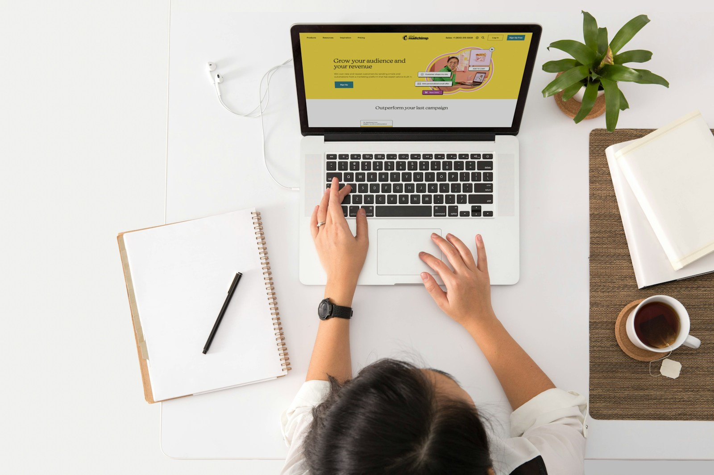

애드센스 블로그를 시작한다고 하면 보통 먼저 떠올리는 것은 글 개수다. 하지만 글 개수보다 먼저 정해야 하는 것은 블로그의 기준이다.

이 블로그는 단순 데이터라벨링, 해외 설문, 정체가 불분명한 앱테크를 메인 소재로 두지 않는다. 대신 Outlier 같은 AI 트레이닝 플랫폼, 바이브 코딩, 전자책, 블로그 운영처럼 한국인이 집에서 확인하고 실험할 만한 AI 부업을 기록한다.

## 주제는 좁게 잡는다

큰 주제는 AI 부업이지만 모든 AI 부업을 다루지는 않는다.

- 애드센스 블로그 운영
- 전자책 판매와 템플릿 상품
- AI 숏폼 대본과 편집
- 블로그 원고 대행
- 스마트스토어 상세페이지 문구
- 프리랜서 플랫폼 프로필 만들기

주제를 좁히면 글감은 줄어든다. 대신 방문자가 이 블로그가 어떤 문제를 다루는지 빠르게 이해한다.

## 글은 실험 기록으로 쓴다

AI 초안을 그대로 올리는 방식은 오래가기 어렵다. 그래서 글 구조는 아래처럼 잡는다.

1. 하려는 실험
2. 사용한 도구와 조건
3. 실제 산출물
4. 들어간 시간
5. 막힌 부분
6. 다음에 수정할 점

방문자는 가능하다는 말보다 어디서 막히고 어떻게 고쳤는지를 보고 싶어 한다.

## 첫 목표

처음 목표는 월수익이 아니다.

- 글 30개 작성
- 카테고리 4개 유지
- 검색 유입이 생기는 글 파악
- 애드센스 승인 신청
- 문의 또는 전자책 클릭 발생 여부 확인

수익은 그 다음이다. 먼저 블로그가 특정 문제를 꾸준히 해결하는 사이트처럼 보여야 한다.
