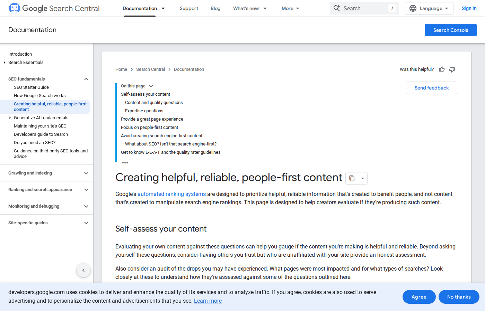
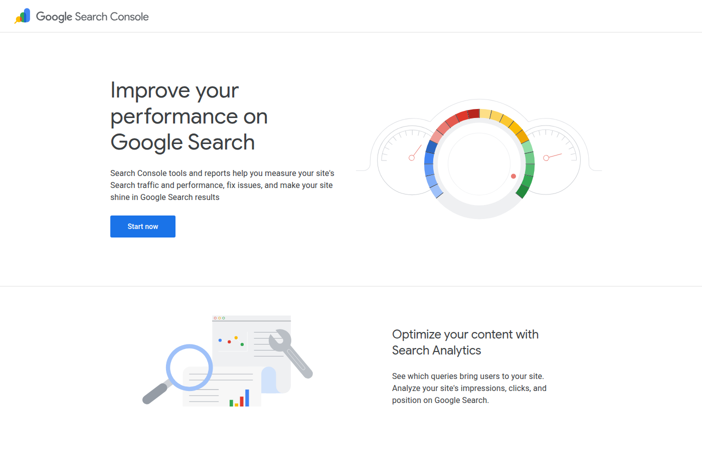
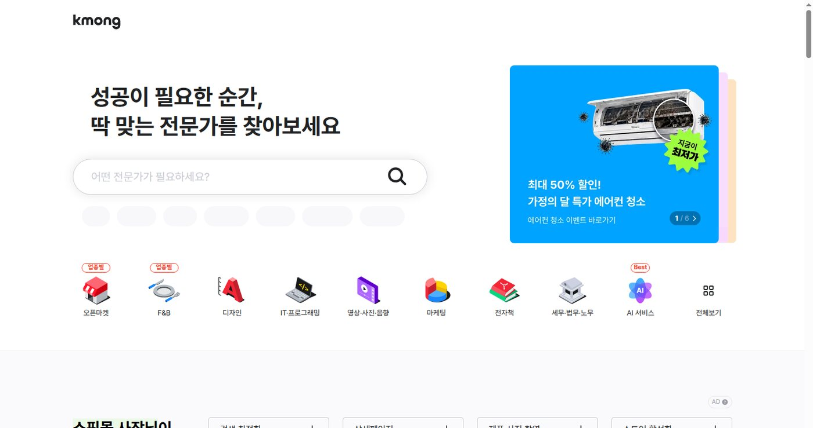

블로그를 시작하고 한동안은 글감을 키워드에서 찾았다. "AI 부업", "재택 부업 추천", "ChatGPT로 돈 버는 법". 검색량이 크니까 당연히 여기서 출발해야 한다고 생각했는데, 몇 편 써보니 문제가 보였다. 본문이 전부 비슷해진다. 키워드가 넓으면 글도 넓어지고, 넓은 글은 결국 어디서 본 듯한 추천 목록으로 끝난다.

그래서 방법을 바꿨다. 정보성 블로그 제목을 1,100개 정도 모아서 훑어봤는데, 잘 읽히는 제목에는 패턴이 있었다. "~전에 확인할 것", "~하는 이유", "~후기", "~체크". 단순 추천형이 아니라 어딘가에서 막힌 사람을 위한 제목들이다. 여기서 가져올 건 형식이 아니라 관점이었다. 글감은 키워드가 아니라 검색자가 막히는 장면에서 나온다.

_출처: [Google Search Central 유용한 콘텐츠 가이드](https://developers.google.com/search/docs/fundamentals/creating-helpful-content) 화면 직접 캡처_

## 검색자가 실제로 묻는 말을 먼저 적는다

"Outlier"라는 키워드를 그대로 쓰면 플랫폼 소개글이 된다. 그런데 Outlier를 검색하는 사람이 정말 궁금한 건 소개가 아니다. 지금 가입해도 일감이 있는지, 한국어로 가능한지, 심사는 어떻게 준비하는지다. 이 막힌 지점을 잡으면 같은 키워드에서 전혀 다른 글이 나온다.

내가 큰 키워드를 질문으로 바꾼 예시는 이렇다. "AI 부업"은 "한국인이 집에서 직접 확인 가능한 일은 무엇인가"로. "DataAnnotation"은 "코딩 작업을 노린다면 무엇을 준비해야 하나"로. "바이브 코딩"은 "초보가 외주로 팔아도 되는 작업은 어디까지인가"로. "애드센스"는 승인 글 개수 타령 대신 "승인 전에 사이트 구조를 어떻게 점검하나"로. 키워드는 그대로인데 글이 좁아지고, 좁아진 만큼 쓸 말이 생긴다.

## 글감 노트는 세 칸이면 충분했다

한때 키워드 도구로 복잡한 표를 만들어봤는데 오래 못 갔다. 지금 쓰는 글감 노트는 세 칸이 전부다.

첫 칸에는 검색자가 처음 접하는 이름을 적는다. Outlier, AdSense, CapCut, v0 같은 것들. 둘째 칸에는 그 이름을 접한 다음 막히는 장면을 적는다. 심사가 있다는데 뭘 보지? 단가는? 첫 작업은 어떻게 받지? 셋째 칸에는 글에서 보여줄 근거를 적는다. 공식 화면 캡처, 공개 마켓 화면, 직접 만든 샘플, 수정 전후 비교.

세 칸이 다 안 채워지면 아직 글감이 아니다. 단어만 있으면 글이 넓어지고, 막힌 장면이 있어야 제목이 좁아지고, 근거가 있어야 본문이 정보 글처럼 읽힌다. 이 기준 하나로 "쓸까 말까" 고민하는 시간이 많이 줄었다.

## 공식 문서가 의외로 좋은 글감 창고다

상단 대표 이미지는 [Google Search Central의 유용한 콘텐츠 문서](https://developers.google.com/search/docs/fundamentals/creating-helpful-content)를 캡처한 것이다. 이 문서는 검색엔진이 아니라 사람에게 도움이 되는 콘텐츠를 먼저 만들라고 안내하는데, 읽다 보면 그 자체가 글감 목록이다.

_출처: [Google Search Console](https://search.google.com/search-console/about) 화면 직접 캡처_

"사람 우선 콘텐츠"라는 항목을 보면 'AI 초안을 그대로 올리면 왜 얕아지는가'라는 글이 떠오르고, 자체 점검 질문 목록을 보면 '발행 전 체크리스트'가 떠오른다. 검색엔진 우선 콘텐츠에 대한 경고를 보면 '제목 낚시를 피하는 법'이 나온다. "AI 부업은 돈이 됩니다"에서 멈추면 글이 얕은데, 공식 문서를 한 번 거치면 질문이 "이 글이 검색자의 문제를 실제로 해결하는가"로 바뀐다.

## 공개 마켓에서 수요를 본다

공식 문서가 콘텐츠의 기준을 보여준다면, 공개 마켓 화면은 사람들이 실제로 뭘 사고파는지 보여준다. [크몽](https://kmong.com/)에 들어가 보면 전자책, 마케팅, IT·프로그래밍, AI 서비스 카테고리가 나란히 있다. 전자책 카테고리를 보면 업데이트 로그와 번들 구성이 글감이 되고, 마케팅 카테고리를 보면 블로그 원고 대행과 상세페이지 문구가 글감이 된다.

_출처: [크몽](https://kmong.com/) 화면 직접 캡처_

이렇게 보면 애드센스 글감이 혼자 떨어져 있지 않다는 게 보인다. 블로그 글 하나가 검색 유입을 만들고, 그 글에서 전자책이나 포트폴리오 글로 넘어가고, 다시 문의나 판매 페이지로 이어진다. 글감을 고를 때부터 이 연결을 생각하면 글이 따로 놀지 않는다.

## 제목은 좁게, 본문은 깊게

모은 제목 패턴을 이 블로그 주제에 맞게 바꿔보면 이런 식이다. "AI 부업 추천 총정리" 대신 "한국인이 집에서 확인하는 AI 부업만 골라보기". "ChatGPT로 돈 버는 법" 대신 "AI 블로그 원고 대행 전 자료 요청표와 납품 범위". "초보도 가능한 재택 부업" 대신 "숏폼 외주는 20초 대본부터 시작하는 편이 안전하다".

제목이 좁아지면 표와 이미지도 자연스럽게 따라온다. AdSense 글에는 AdSense 화면이 들어가고, 크몽 수요를 말하는 글에는 크몽 화면이 들어간다. 발행 전에 스스로 묻는 건 다섯 가지다. 이 글이 하나의 질문에서 시작하는가. 첫 문단이 검색자의 상황을 잡는가. 공식 화면이나 마켓 화면이 들어갔는가. 표가 본문을 정리해주는가. 다음 글로 이어지는가.

AI 부업 블로그는 글을 쌓는 일이 맞지만, 많이 쌓는 것만으로는 부족하다. 검색자가 들어와서 "어, 내 질문을 알고 있네"라는 느낌을 받아야 한다. 그래서 이 블로그의 글감은 키워드 도구보다 공식 화면, 공개 마켓, 실제 작업 샘플에서 먼저 나온다.

참고한 화면과 문서: [Google AdSense](https://www.google.com/adsense/start/), [크몽](https://kmong.com/), [Google 유용한 콘텐츠 가이드](https://developers.google.com/search/docs/fundamentals/creating-helpful-content)
