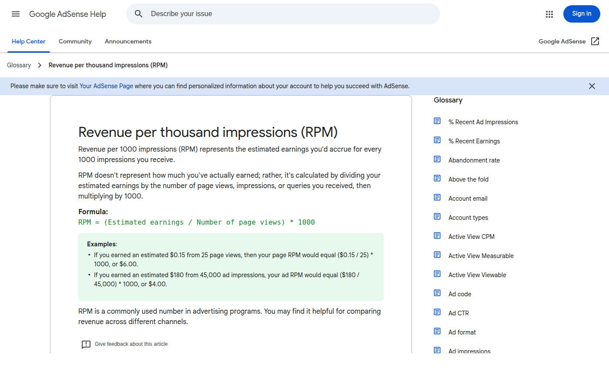

승인을 기다리는 동안 해외 후기를 꽤 많이 읽었다. 월 천 달러를 번다는 사람, 첫 달에 3센트를 봤다는 사람. 숫자가 너무 제각각이라 오히려 감이 안 잡혔는데, 공식 문서를 읽고 나서야 이유를 알았다. 애드센스 수익은 결국 페이지뷰 곱하기 RPM이고, 이 두 숫자가 블로그마다 완전히 다르기 때문이다. 승인되면 광고는 붙지만, 트래픽이 없으면 대시보드는 0원 근처에 머문다.

이 글은 승인 직후의 기대치를 현실적으로 잡기 위해 정리한 계산 메모다. [Google AdSense 도움말의 RPM 설명](https://support.google.com/adsense/answer/190515)과 지급 기준액, 무효 트래픽 안내를 기준으로 삼았다.

_출처: [Google AdSense RPM 도움말](https://support.google.com/adsense/answer/190515) 화면 직접 캡처_

## RPM 계산식 자체는 단순하다

Google은 RPM을 "예상 수입을 노출수나 페이지 조회수 1,000회 기준으로 환산한 지표"로 설명한다. 페이지 RPM으로 단순화하면 이렇다. 예상 수입을 페이지뷰로 나누고 1,000을 곱한다. 페이지 RPM이 4달러라면, 페이지뷰 1,000회당 4달러쯤 들어온다는 뜻이다.

이 식을 알고 나면 승인 직후에 봐야 할 게 "광고가 붙었나"가 아니라 "하루 페이지뷰가 안정적으로 나오나"라는 게 분명해진다. 페이지뷰별로 계산해보면 이렇다.

| 월 페이지뷰 | RPM 2달러 | RPM 4달러 | RPM 10달러 |
| --- | ---: | ---: | ---: |
| 1,000 | $2 | $4 | $10 |
| 10,000 | $20 | $40 | $100 |
| 50,000 | $100 | $200 | $500 |
| 100,000 | $200 | $400 | $1,000 |

표를 보면 승인만으로 큰돈을 기대하기 어렵다는 게 한눈에 보인다. 월 1만 페이지뷰에 RPM 4달러면 40달러. 해외 후기의 화려한 숫자는 대부분 트래픽이 이미 큰 블로그 이야기다.

## 승인 직후 0원이어도 이상한 게 아니다

승인 직후에는 방문자가 적고 글별 유입도 아직 자리를 못 잡는다. 하루 방문자가 10명, 20명인 상태에서는 RPM이 계산되어 나와도 별 의미가 없다. 클릭 한 번, 노출 한 번에 숫자가 널뛰기 때문이다.

그래서 단계별로 볼 것을 다르게 잡았다. 방문자가 거의 없을 때는 색인 상태와 글 추가가 먼저다. 하루 100~300 페이지뷰쯤 되면 광고 노출과 모바일 UX를 관찰하고, 하루 1,000을 넘기면 그제야 글별 RPM과 CTR, 체류 시간을 본다. 초보 블로그의 첫 목표는 월 100만 원이 아니다. 광고가 정상 노출되는지, 어떤 글에서 검색 유입이 생기는지, 모바일에서 광고가 글 읽기를 방해하지 않는지 확인하는 것이다.

_출처: [Google AdSense](https://www.google.com/adsense/start/) 화면 직접 캡처_

## 지급 기준액을 모르면 수익을 착각한다

대시보드에 몇 달러가 찍혔다고 바로 통장에 들어오는 게 아니다. [Google의 지급 기준액 표](https://support.google.com/adsense/answer/1709871)를 보면 USD 기준 지급 기준액은 100달러다. 100달러가 쌓일 때까지는 이월된다. [지급 일정 문서](https://support.google.com/adsense/answer/7164703)와 결제 정보 설정, 지급 보류 여부도 같이 확인해야 한다.

이걸 모르면 첫 수익을 과대평가하기 쉽다. 대시보드에 5달러가 찍히는 것과 실제 입금은 다른 문제다. 위의 페이지뷰 표에 대입해보면, 월 5만 페이지뷰 정도가 되어야 지급 기준액을 현실적으로 노려볼 수 있는 구간이다. 그 전까지는 수익보다 데이터를 본다고 생각하는 편이 정신 건강에 좋다.

## 수익보다 계정 안정성이 먼저다

초반에 제일 조심할 건 무효 트래픽이다. [Google의 무효 트래픽 안내](https://www.google.com/ads/adtrafficquality/invalid-activity/)는 실제 관심 없는 클릭이나 노출, 자동화된 활동, 실수 클릭을 유발하는 광고 배치까지 폭넓게 다룬다.

본인이 자기 광고를 클릭하는 것, 가족이나 지인에게 클릭을 부탁하는 것은 당연히 안 된다. 광고를 버튼처럼 보이게 배치해서 실수 클릭을 유도하는 것도 마찬가지다. 초반 수익이라 해봐야 몇백 원인데, 그것 때문에 계정이 흔들리면 완전히 손해다. 광고를 많이 넣고 싶은 유혹도 있는데, 모바일에서 광고가 제목과 본문을 가리면 결국 이탈만 늘어난다. 승인 후에는 광고 개수보다 글 읽는 경험을 먼저 봐야 한다.

## 첫 30일은 돈 세는 기간이 아니라 데이터 쌓는 기간

승인 후 첫 달의 내 계획은 이렇다. 1주차에는 ads.txt와 자동 광고가 정상 동작하는지, 모바일에서 광고 위치가 괜찮은지 확인한다. 2주차에는 검색 유입용 글을 추가하면서 Search Console 노출과 색인 상태를 본다. 3주차에는 글별 페이지뷰와 체류, 내부 링크 클릭을 보고, 4주차에 유입 검색어와 글별 RPM 차이를 보면서 다음 달 글감을 정한다.

_출처: [Google Search Console](https://search.google.com/search-console/about) 화면 직접 캡처_

이 블로그에서는 승인 후 수익을 과장하지 않으려고 한다. 해외 후기 숫자는 참고만 하고, 실제로는 내 글의 검색 유입과 체류를 본다. 애드센스는 독자가 들어올 이유가 있는 글 위에 얹는 기본 수익층이지, 그 자체가 목적이 되면 순서가 꼬인다.

참고한 공식 문서: [AdSense RPM 설명](https://support.google.com/adsense/answer/190515), [AdSense 지급 기준액](https://support.google.com/adsense/answer/1709871), [AdSense 지급 일정](https://support.google.com/adsense/answer/7164703), [Google 광고 무효 트래픽 설명](https://www.google.com/ads/adtrafficquality/invalid-activity/)
