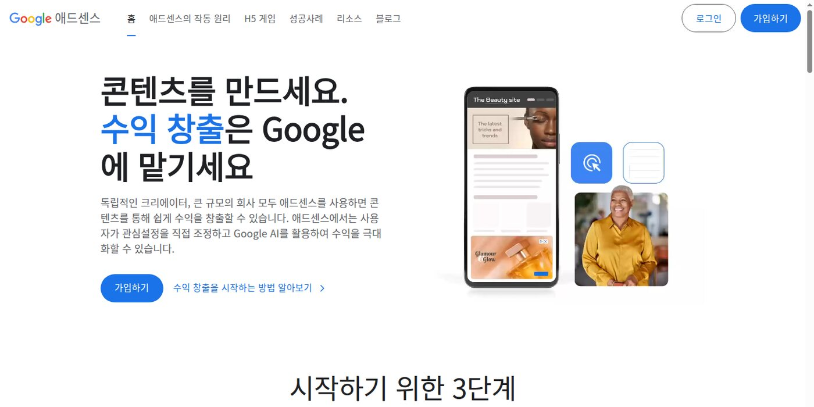

애드센스 신청을 넣고 나면 마음이 급해진다. 승인만 되면 바로 광고가 붙고, 광고가 붙으면 통장에 돈이 쌓일 것처럼 느껴진다. 나도 처음에는 그렇게 생각했다. 그런데 해외 커뮤니티 후기를 보면 분위기가 조금 다르다.

승인은 끝이 아니라 시작에 가깝다. 어떤 사람은 첫 주에 몇 달러를 벌고 좋아한다. 어떤 사람은 두 달째에 몇백 유로를 찍는다. 반대로 여러 사이트를 승인받았는데도 몇 년 동안 도메인값도 못 뽑았다는 후기도 있다. 차이는 승인 여부가 아니라 **트래픽, 주제, 방문자 국가, 광고 배치, 재방문 구조**에서 갈린다. 📉

_참고자료 사진: 애드센스 승인은 수익화의 출발점이지, 수익 보장은 아니다._

> 💸 **먼저 현실 체크**
> - 승인 직후 수익이 0원이어도 이상한 일이 아니다.
> - 페이지뷰가 적으면 RPM 숫자도 크게 흔들린다.
> - 본인 광고 클릭이나 지인 클릭 부탁은 절대 하면 안 된다.

이 글은 해외 커뮤니티 글을 그대로 번역한 글이 아니다. 공개된 Reddit 후기에서 나온 숫자를 보고, 한국어 블로그를 막 시작하는 입장에서 무엇을 기대하고 무엇을 조심해야 하는지 정리한 기록이다.

## 먼저 봐야 하는 숫자는 RPM이다

애드센스 수익을 볼 때 제일 먼저 이해해야 할 숫자는 RPM이다. Google은 RPM을 1,000회 노출 또는 페이지 조회가 발생했을 때 예상되는 수입을 보는 지표로 설명한다. 계산식은 단순하다.

| 지표 | 의미 |
| --- | --- |
| 페이지뷰 | 방문자가 페이지를 본 횟수 |
| 예상 수입 | 애드센스에서 잡힌 예상 광고 수익 |
| 페이지 RPM | 예상 수입을 페이지뷰 기준 1,000회로 환산한 값 |

예를 들어 페이지 RPM이 4달러라면, 단순 계산으로 페이지뷰 1,000회에 4달러 정도를 기대한다는 뜻이다. 그래서 승인 직후에는 "광고가 붙었나?"보다 "하루에 몇 페이지뷰가 안정적으로 나오나?"를 먼저 봐야 한다.

| 월 페이지뷰 | RPM 2달러 | RPM 4달러 | RPM 10달러 |
| --- | ---: | ---: | ---: |
| 1,000 | $2 | $4 | $10 |
| 10,000 | $20 | $40 | $100 |
| 50,000 | $100 | $200 | $500 |
| 100,000 | $200 | $400 | $1,000 |

이 표만 봐도 답이 나온다. 승인만으로 돈방석은 어렵다. 수익은 결국 페이지뷰와 RPM의 곱이다.

## 해외 후기 1: 첫 주 수익은 커피값일 수 있다

Reddit r/AdSense에는 승인 후 첫 주 수익을 공개한 초보 블로거 후기가 있었다. 정원과 웰니스 주제 블로그를 운영했고, 4개월 동안 네 번 거절된 뒤 승인됐다고 한다. 승인 후 첫 7일 애드센스 수익은 3.64달러, Amazon Associates까지 합친 첫 주 수익은 7.25달러였다.

이 숫자는 작아 보이지만 중요한 점이 있다. 이 사람은 첫 주에 큰돈을 번 게 아니라, **월 호스팅 비용을 넘겼다**는 점을 의미 있게 봤다. 처음부터 월 100달러를 기대한 것이 아니라 "이제 비용을 회수하는 실험이 시작됐다"는 관점이다.

우리 블로그도 이 관점이 맞다. 승인 직후 목표를 월 100만 원으로 잡으면 금방 실망한다. 처음 목표는 광고가 정상 노출되는지, RPM이 어느 범위에서 움직이는지, 어떤 글에서 유입이 생기는지 보는 것이다.

## 해외 후기 2: 페이지뷰가 있어야 숫자가 움직인다

다른 후기에서는 승인 후 첫 이틀 수익을 공개했다. 페이지뷰 1,458회, 총 수익 6.46달러, 페이지 RPM 4.43달러 수준이었다. 하루 600명 정도의 방문자가 있는 모바일 중심 사이트라고 설명했다.

여기서 볼 포인트는 수익보다 페이지뷰다. 페이지뷰가 하루 수백에서 천 단위로 움직이면, 애드센스 대시보드도 읽을 만한 숫자를 보여준다. 반대로 하루 방문자가 10명, 20명인 상태에서는 RPM을 계산해도 의미가 약하다. 클릭 한 번, 광고 한 번에 숫자가 크게 흔들리기 때문이다.

| 상황 | 해석 |
| --- | --- |
| 승인 직후 방문자 거의 없음 | 수익보다 색인과 글 추가가 먼저 |
| 하루 100~300 페이지뷰 | 광고 노출과 UX를 조심스럽게 관찰 |
| 하루 1,000 페이지뷰 이상 | RPM, CTR, 글별 수익 차이를 보기 시작 |
| 월 50,000 페이지뷰 이상 | 애드센스 외 수익 모델도 같이 붙일 구간 |

이 블로그는 아직 승인과 색인 단계다. 지금 해야 할 일은 광고 위치를 만지는 것보다 검색 유입이 생길 글을 쌓는 것이다.

## 해외 후기 3: 두 달째에 숫자가 커지는 사례도 있다

조금 더 희망적인 사례도 있다. 한 Reddit 사용자는 애드센스 수익이 나는 두 번째 달이라고 하면서, 하루 페이지뷰 7,174회, 페이지 RPM 3.10유로, 당일 예상 수익 22.24유로, 최근 7일 128.49유로, 해당 월 누적 413.03유로라는 숫자를 공개했다.

겉으로 보면 꽤 좋아 보인다. 하지만 이 사례에서도 핵심은 "두 번째 달"이 아니라 **하루 7천 페이지뷰**다. CPC가 0.06유로로 낮아도 페이지뷰가 받쳐주니 월 수익이 생긴다.

이 사례는 두 가지를 같이 보여준다.

| 보이는 숫자 | 실제로 봐야 할 것 |
| --- | --- |
| 월 누적 400유로 이상 | 트래픽이 이미 하루 수천 페이지뷰 |
| CPC 0.06유로 | 클릭당 단가가 낮아도 볼륨으로 보완 |
| CTR 5% | 광고 위치와 방문 의도 영향 가능 |
| 정보성/기술 주제 | 주제와 국가에 따라 RPM 차이 큼 |

즉 "애드센스는 안 된다"도 아니고 "승인되면 바로 된다"도 아니다. 트래픽이 생기면 작동하지만, 트래픽 없는 승인은 거의 조용하다.

## 해외 후기 4: 승인 사이트가 많아도 돈이 안 될 수 있다

반대 사례도 봐야 한다. 어떤 사용자는 애드센스 승인 사이트를 여러 개 운영했지만, 장기간 수익이 거의 없었다고 했다. 심지어 100개 가까운 사이트를 승인받은 경험이 있는데도 수익이 낮았다고 적었다.

이 후기가 중요한 이유는 애드센스의 함정을 보여주기 때문이다. 사이트 수가 많다고 수익이 자동으로 늘지 않는다. 글이 많아도 검색자가 다시 찾을 이유가 없고, 주제가 얇고, 유입 경로가 약하면 광고 수익은 거의 움직이지 않는다.

| 착각 | 현실 |
| --- | --- |
| 사이트를 여러 개 만들면 수익이 분산해서 들어온다 | 관리 안 되는 얇은 사이트가 늘어날 수 있다 |
| 승인만 많이 받으면 유리하다 | 승인보다 검색 유입과 체류가 중요하다 |
| 글을 많이 올리면 된다 | 검색 의도에 맞는 글이 쌓여야 한다 |
| 광고를 많이 넣으면 수익이 늘어난다 | UX가 나빠지고 이탈이 빨라질 수 있다 |

우리 블로그는 여러 개 사이트를 벌리는 방향으로 가면 안 된다. `aiforsane.kr` 하나에 AI 부업, 애드센스, 글감, 실제 도구 확인을 계속 쌓는 편이 낫다.

## 해외 후기 5: 승인 후에는 욕심내지 않는 세팅이 중요하다

1개월 된 사이트가 승인됐다는 후기도 있었다. 하루 200~300 페이지뷰 정도이고, `ads.txt`를 추가했고, 자동 광고를 켰으며, 초반에는 수익보다 정책 위반과 무효 트래픽을 피하는 것을 더 걱정하고 있었다.

이 태도가 초보에게는 더 안전하다. 승인 직후에는 광고를 더 많이 넣는 것보다 아래를 먼저 보는 편이 낫다.

| 초반 체크 | 이유 |
| --- | --- |
| ads.txt 정상 접근 | 게시자 인증 기본 |
| 개인정보처리방침 링크 | 광고와 쿠키 안내 |
| 자동 광고 과다 노출 여부 | 글 읽기 방해 방지 |
| 모바일에서 광고가 본문을 가리는지 | accidental click 위험 줄이기 |
| 본인 광고 클릭 금지 | 무효 트래픽 리스크 |

Google은 무효 트래픽을 실제 관심 없는 클릭이나 노출, 자동화된 활동, 실수 클릭을 유발하는 광고 구현까지 포함해 넓게 본다. 그래서 초반에는 가족이나 지인에게 "광고 눌러줘" 같은 말을 절대 하면 안 된다. 수익 몇백 원보다 계정 안정성이 먼저다.

## 승인 후 30일 목표를 이렇게 잡는다

애드센스 승인 후 첫 30일은 돈을 세는 기간보다 데이터가 쌓이는 기간으로 보는 게 현실적이다.

| 기간 | 목표 | 볼 지표 |
| --- | --- | --- |
| 1주차 | 광고 정상 노출 확인 | ads.txt, 자동 광고, 모바일 UX |
| 2주차 | 검색 유입 글 추가 | Search Console 노출, 색인 상태 |
| 3주차 | 글별 반응 확인 | 페이지뷰, 체류, 클릭률 |
| 4주차 | 다음 달 글감 결정 | 유입 검색어, RPM, 내부 링크 |

수익 목표도 작게 잡는다.

| 단계 | 현실적인 목표 |
| --- | --- |
| 승인 직후 | 0원이어도 정상 |
| 첫 1달 | 광고 노출과 색인 안정화 |
| 월 1만 페이지뷰 | 커피값~소액 수익 확인 |
| 월 5만 페이지뷰 | 지급 기준액을 노려볼 수 있는 구간 |
| 월 10만 페이지뷰 이상 | 애드센스 외 상품 연결도 같이 볼 구간 |

애드센스 지급도 바로 되는 것이 아니다. USD 기준으로는 지급 기준액이 100달러다. 즉 대시보드에 몇 달러가 찍혀도, 기준액을 넘고 지급 절차가 끝나야 실제 통장으로 들어온다.

## 이 블로그에 적용할 결론

해외 후기들을 보면 결론은 꽤 분명하다. 애드센스 승인 자체는 기쁜 일이다. 하지만 승인보다 더 중요한 것은 승인 후에 어떤 글이 검색 유입을 만들고, 어떤 방문자가 다시 들어오고, 어떤 주제가 RPM을 유지하는지 보는 일이다.

이 블로그는 앞으로 애드센스를 이렇게 다룰 생각이다.

- 승인 후 수익을 과장하지 않는다
- 해외 후기 숫자는 출처 링크와 함께 참고만 한다
- 글을 그대로 번역하거나 긁어오지 않는다
- 검색자가 실제로 막히는 질문을 제목으로 쓴다
- 애드센스만 기다리지 않고 전자책, 템플릿, 문의 흐름도 같이 본다

돈방석은 승인 버튼에서 나오지 않는다. 돈이 되려면 검색자가 들어올 이유가 있어야 하고, 들어온 사람이 다른 글도 읽을 이유가 있어야 한다. 애드센스는 그 흐름 위에 얹는 기본 수익층에 가깝다.

참고한 자료:
[Google AdSense RPM 설명](https://support.google.com/adsense/answer/190515?hl=ko),
[Google AdSense 지급 기준액](https://support.google.com/adsense/answer/1709871?hl=ko),
[Google 광고 무효 트래픽 설명](https://www.google.com/ads/adtrafficquality/invalid-activity/),
[승인 후 첫 주 수익 후기](https://www.reddit.com/r/Adsense/comments/1s0gxt9/one_week_ago_i_got_approved_for_adsense_here_are/),
[승인 후 첫 이틀 수익 후기](https://www.reddit.com/r/Adsense/comments/1nxnh88/how_much_my_website_has_made_with_google_adsense/),
[두 번째 달 수익/RPM 질문](https://www.reddit.com/r/Adsense/comments/1tmjl7s/second_month_with_adsense_revenue_happy_with_the/),
[유기적 트래픽만으로 수익화가 되는지 묻는 후기](https://www.reddit.com/r/Adsense/comments/1qvcex8/adsense_is_it_realistic_to_monetize_a_website/),
[1개월 된 사이트 승인 후 자동 광고 조언 요청](https://www.reddit.com/r/Adsense/comments/1plhnvi/adsense_approved_on_1monthold_site_200300_daily/)
