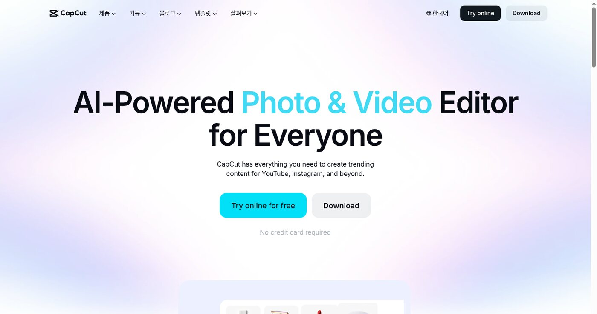
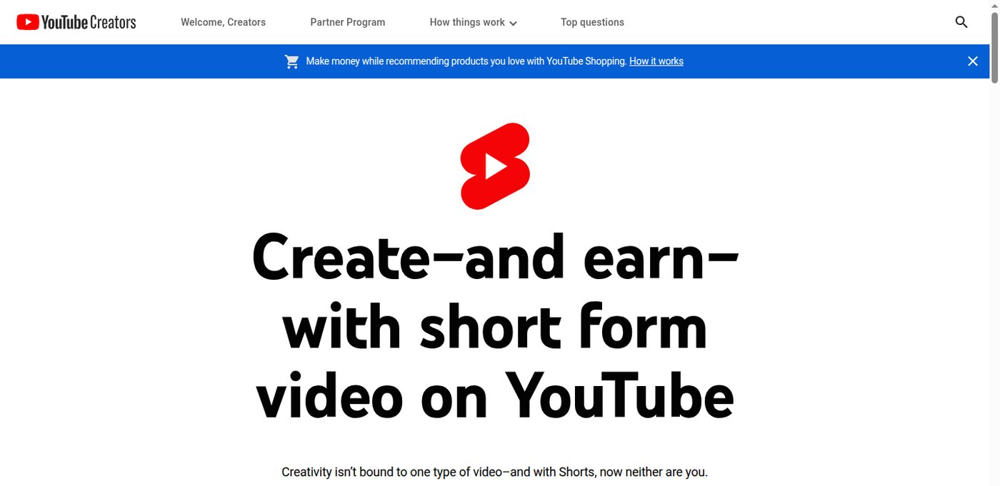

AI 숏폼 제작은 재택 부업으로 시작하기 좋은 편이다. 결과물이 비교적 눈에 보이기 때문이다. 대본, 자막 문장, 썸네일 문구, 장면 구성, 완성 영상처럼 납품물을 나눌 수 있다.

문제는 처음부터 전부 하려고 할 때 생긴다. 조회수 보장, 대본, 편집, 썸네일, 업로드까지 한 번에 맡으면 일이 커진다. 초보 프리랜서라면 먼저 **대본과 자막 문장처럼 작은 산출물**부터 팔아야 한다. 🎬

_참고자료 사진: 숏폼 부업은 완성 영상보다 작게 나눈 납품물에서 시작하는 편이 안전하다._

| 가능한 일 | 처음부터 팔기 좋은가 | 이유 |
| --- | --- | --- |
| 20초 대본 | 좋음 | 범위가 작고 수정 기준이 분명함 |
| 자막 문장 | 좋음 | 화면용 문장을 짧게 다듬는 작업 |
| 썸네일 문구 | 좋음 | 여러 후보를 빠르게 만들 수 있음 |
| 편집안 | 보통 | 컷 순서와 자막 위치까지만 제안 |
| 완성 영상 | 나중에 | 수정, 음원, 저작권, 파일 관리가 커짐 |

## ✍️ 처음에는 대본부터 판다

완성 영상은 할 일이 많다. 소재 조사, 대본, 컷 편집, 자막, 템플릿, 음원, 썸네일, 내보내기, 업로드 비율 확인까지 들어간다. 한 단계만 어긋나도 수정 시간이 늘어난다. 반면 대본은 범위가 작다. 첫 3초 후킹, 본문 흐름, 마지막 행동 유도만 정하면 된다.

| 대본 상품명 | 납품물 |
| --- | --- |
| 제품 소개용 20초 숏폼 대본 5개 | 후킹, 본문, CTA |
| 전자책 홍보용 릴스 대본 3개 | 문제 제기, 해결 기준, 구매 연결 |
| 동네 매장 이벤트 쇼츠 문구 10개 | 첫 화면 문구, 짧은 내레이션 |
| 블로그 유입용 쇼츠 대본 5개 | 글 주제 요약, 저장 유도 |

_참고자료 사진: 대본은 화면용 문장과 말로 읽을 문장을 나누어 봐야 한다._

AI는 소재를 여러 각도로 뽑고, 첫 문장을 여러 버전으로 만들고, 자막 문장을 짧게 줄이는 데 쓴다. 하지만 그대로 납품하면 안 된다. AI는 자주 길게 설명하고, 화면에 올라갈 문장과 말로 읽을 문장을 구분하지 못한다.

## 🧰 실제 편집 도구 화면을 본다

숏폼 글을 쓰거나 상품을 만들 때 스마트폰 사진만 넣으면 부족하다. 실제로 어떤 도구를 쓰는지 보여줘야 한다. 아래는 CapCut 공식 홈 화면이다. AI 기반 사진·영상 편집기라는 메시지와 온라인 사용 버튼이 보인다.

_참고자료 사진: CapCut 화면을 보면 대본 이후에 편집, 자막, 템플릿 작업이 이어진다는 점이 보인다._

CapCut은 편집까지 가능하게 해준다. 그래서 초보는 오히려 조심해야 한다. 도구가 가능하다고 해서 처음부터 완성 영상 납품을 맡으면 시간이 크게 늘어난다.

| 산출물 | 설명 | 초보 추천 |
| --- | --- | --- |
| 대본 | 말로 읽을 문장 | 추천 |
| 자막 문장 | 화면에 올라갈 짧은 문장 | 추천 |
| 썸네일 문구 | 클릭 전 보이는 제목 후보 | 추천 |
| 편집안 | 장면 순서와 자막 위치 | △ |
| 완성 영상 | 실제 편집 파일 | 나중에 |

## 📱 Shorts 화면에서 수익보다 포맷을 본다

YouTube Creators의 Shorts 안내 화면도 같이 본다. 화면은 short form video와 create and earn을 강조한다. 이 문구만 보면 수익화가 먼저 보이지만, 프리랜서 관점에서는 포맷이 더 중요하다.

_참고자료 사진: Shorts는 수익보다 먼저 짧은 시간 안에 메시지를 끝내는 포맷으로 봐야 한다._

30초 대본은 길지 않다. 아래 흐름으로 쪼개면 AI 초안도 다루기 쉬워진다.

| 시간 | 역할 | 예시 |
| --- | --- | --- |
| 0-3초 | 멈추게 하는 문장 | "AI 부업 글감이 매번 막힌다면" |
| 3-12초 | 상황 설명 | "키워드만 보면 글이 다 비슷해집니다" |
| 12-25초 | 해결 기준 | "먼저 검색자가 막힌 지점을 표로 적습니다" |
| 25-30초 | 행동 유도 | "체크리스트는 블로그에 정리해뒀습니다" |

## 🧪 업종별 예시를 만든다

포트폴리오가 없을 때는 업종별 샘플을 만든다. 실제 고객을 기다릴 필요는 없다. 전자책, 온라인 클래스, 스마트스토어, 동네 매장, 개인 브랜딩처럼 있을 법한 상황을 정하고 대본을 만든다.

| 업종 | 좋은 시작 문장 | 피할 문장 |
| --- | --- | --- |
| 전자책 | "AI 부업 글을 쓰려는데 제목에서 막힌다면" | "쉽고 빠르게 돈 버는 법" |
| 스마트스토어 | "비 오는 날 운동화가 젖는 게 싫다면" | "최고의 품질을 자랑합니다" |
| 동네 매장 | "퇴근 후 30분만 비는 사람에게 맞춘 클래스" | "누구나 만족하는 서비스" |
| 개인 브랜딩 | "포트폴리오가 없어 첫 의뢰를 못 받고 있다면" | "전문가처럼 보이게 해드립니다" |

숏폼 문장은 짧아야 한다. "본 제품은 일상생활에서 편리하게 활용할 수 있습니다"보다 "가방 안에서 바로 꺼내 쓰기 쉽습니다"가 낫다. 한 화면에는 한 메시지만 남긴다.

## 🧾 수정 범위를 계약처럼 적는다

숏폼 작업에서 분쟁이 생기는 부분은 수정 범위다. 의뢰인은 대본만 고치려는 것인지, 영상 편집까지 바꾸려는 것인지 구분하지 않을 때가 많다. 그래서 상품 설명에 작업 범위를 계약서처럼 적어야 한다.

| 상품 | 포함 | 제외 |
| --- | --- | --- |
| 대본 상품 | 제목, 후킹, 본문 대사, CTA | 영상 편집, 업로드 |
| 자막 문장 상품 | 화면용 짧은 문장 | 컷 편집, 음원 |
| 편집안 상품 | 컷 순서, 자막 위치 제안 | 실제 편집 파일 |
| 완성 영상 상품 | 편집 파일, 자막, 내보내기 | 원본 촬영, 광고 집행 |

완성 영상까지 맡는다면 원본 영상 제공 방식, 자막 스타일, 음원 사용, 썸네일, 수정 횟수, 납품 파일 형식, 세로 비율, 저작권 책임을 적어야 한다. 이 내용을 적지 않으면 작은 금액의 작업이 오래 끌린다.

## 🔗 블로그 글로 확장한다

숏폼 부업은 애드센스 블로그 글감으로도 좋다. 작업 과정에서 나오는 질문이 많기 때문이다.

- "CapCut으로 편집할 때 자막을 줄이는 법"
- "YouTube Shorts와 Reels 대본 차이"
- "제품 소개 숏폼 대본 5개 만드는 순서"
- "숏폼 대본 외주에서 수정 범위를 적는 법"

첫 제안서도 어렵게 쓸 필요가 없다. 의뢰인의 업종을 한 줄로 확인하고, 이번 작업에서 만들 대본 수와 길이를 적고, 필요한 자료와 수정 횟수를 적으면 된다. "조회수 보장" 같은 말은 빼는 편이 낫다.

AI 숏폼 제작은 집에서 시작해도 된다. 하지만 시작점은 완성 영상이 아니라 작게 나눈 산출물이어야 한다. 대본을 먼저 팔고, 자막 문장과 썸네일 문구를 더하고, 편집안으로 넓히고, 마지막에 완성 영상으로 가는 순서가 안전하다.

참고한 공식 페이지: [CapCut](https://www.capcut.com/), [YouTube Creators Shorts](https://www.youtube.com/creators/shorts/)
