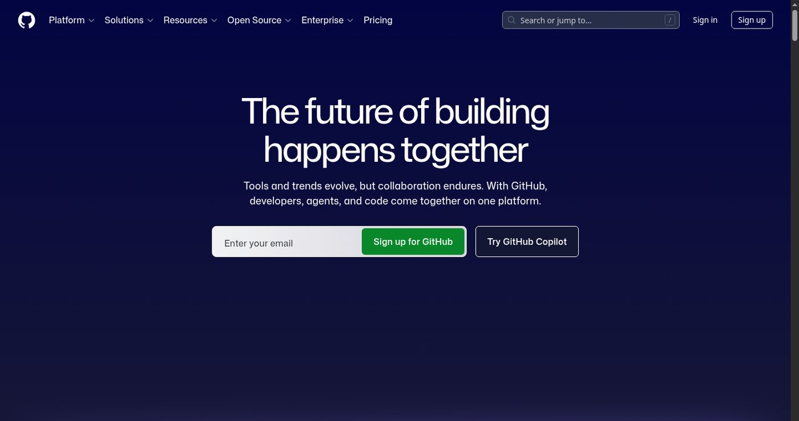

AI 부업을 프리랜서 일로 만들고 싶다면 "할 수 있습니다"라는 말만으로는 부족하다. 의뢰인은 AI를 쓸 수 있다는 말보다 무엇을 만들어봤는지를 본다. 특히 집에서 일하는 프리랜서는 직접 만나는 일이 적기 때문에 결과물로 신뢰를 만들어야 한다. 그래서 포트폴리오는 거창한 웹사이트보다 작은 결과물 3개에서 시작하는 편이 낫다.

처음부터 큰 프로젝트를 만들 필요는 없다. 오히려 작고 분명한 결과물이 좋다. 블로그 글 한 편, 숏폼 대본 한 묶음, 상세페이지 문구 전후 비교 정도면 시작할 수 있다. 이 세 가지는 AI 부업 블로그의 주제와도 맞고, 실제 의뢰로 이어질 가능성도 있다. 중요한 것은 샘플처럼 보이는 문서가 아니라, 문제와 해결 과정을 보여주는 결과물이어야 한다는 점이다.

포트폴리오를 만드는 목적은 예쁘게 보이는 것이 아니다. 의뢰인이 "이 사람에게 맡기면 어떤 방식으로 일하겠구나"를 이해하게 하는 것이다. 그래서 결과물마다 작업 범위, 사용한 자료, 수정 전후, 납품 형태가 보여야 한다. AI를 썼다면 어디에 썼고, 사람 손은 어디에 들어갔는지도 드러나야 한다.

## 첫 번째 결과물은 블로그 글이다

블로그 글은 AI 부업 포트폴리오의 기본이다. 글을 잘 쓴다는 말보다, 하나의 질문을 잡고 근거를 붙여 끝까지 설명할 수 있다는 것을 보여준다. 예를 들어 "Outlier 같은 AI 부업 플랫폼, 한국인이 보기 전에 비교할 것" 같은 글은 단순 소개가 아니다. 플랫폼 공식 화면을 보고, 한국인이 확인해야 할 조건을 정리하고, 어떤 사람에게 맞는지 판단한다.

블로그 글 포트폴리오에는 제목, 목차, 본문 일부, 사용한 이미지, 참고한 공식 페이지를 같이 보여주면 좋다. 완성 글 링크 하나만 던지는 것보다 작업 과정을 조금 보여주는 편이 낫다. 의뢰인은 글을 끝까지 읽지 않을 수도 있다. 대신 제목을 어떻게 좁혔는지, 근거 이미지를 어떻게 넣었는지, 문단 흐름이 자연스러운지를 빠르게 본다.

좋은 블로그 샘플은 검색자가 실제로 묻는 질문에서 시작한다. "AI 부업 추천"처럼 넓은 글보다 "AI 숏폼 제작을 대본 상품부터 시작해야 하는 이유"처럼 좁은 글이 낫다. 좁은 글은 작업자의 판단을 보여준다. 글을 많이 쓰는 능력보다 중요한 것은 글감을 정확히 잡는 능력이다.

## 두 번째 결과물은 숏폼 대본이다

숏폼 대본은 짧지만 포트폴리오로 쓰기 좋다. 첫 3초 후킹, 본문 흐름, 마지막 행동 유도가 분명하게 보이기 때문이다. 영상 편집까지 하지 않아도 대본만으로 작업자의 감각을 보여줄 수 있다. 특히 전자책, 온라인 클래스, 스마트스토어 제품, 동네 매장 같은 주제는 대본 샘플을 만들기 쉽다.

숏폼 대본 포트폴리오에는 완성 문장만 넣지 않는다. 대상, 목표, 영상 길이, 화면 자막, 말로 읽을 문장을 나눠 적는다. 예를 들어 "전자책 홍보용 20초 쇼츠"라면 첫 화면 문구, 내레이션, 중간 전환, 마지막 CTA를 나누면 된다. 이렇게 보여주면 의뢰인은 이 사람이 영상 제작자와 협업할 수 있는지 판단하기 쉽다.

AI를 쓴 대본은 특히 다듬은 흔적이 중요하다. AI 초안은 길고 안전한 표현을 많이 쓴다. 포트폴리오에는 초안 전체를 넣을 필요는 없지만, 한두 문장 정도는 전후 비교로 보여줄 수 있다. "효율적인 방법을 통해 생산성을 높일 수 있습니다"를 "하루 20분짜리 루틴부터 만듭니다"로 줄이는 식이다. 이런 비교가 있어야 AI 초안을 그대로 납품하지 않는다는 점이 보인다.

## 세 번째 결과물은 상세페이지 문구다

상세페이지 문구는 판매자에게 바로 설명하기 좋은 결과물이다. 상품 사진은 있는데 문구가 약한 판매자가 많다. 이때 AI를 써서 고객 질문을 뽑고, 문구를 짧게 고치고, 전후 비교를 보여줄 수 있다. 포트폴리오로 만들 때는 실제 브랜드를 쓰지 않아도 된다. 가상의 텀블러, 반려동물 샴푸, 온라인 강의, 전자책 같은 샘플이면 충분하다.

상세페이지 문구 샘플은 전후 비교가 핵심이다. 수정 전 문장은 일부러 평범하게 둔다. "좋은 소재로 만든 편안한 제품입니다" 같은 문장을 "피부에 닿는 안쪽 면을 부드럽게 처리해 오래 착용해도 덜 거슬립니다"처럼 바꾼다. 완전히 새로운 사실을 만들면 안 된다. 기존 정보 안에서 고객이 궁금해할 부분을 앞쪽으로 꺼내는 것이 포인트다.

이 결과물은 블로그 글과도 연결된다. "AI 초안에서 지워야 할 말", "상세페이지 문구는 고객 질문에서 시작한다", "작은 상품으로 판매자에게 제안하는 법" 같은 글을 쓸 수 있다. 포트폴리오가 단순한 샘플 파일에서 끝나지 않고 블로그 글감으로 이어지는 구조다.

## 공개 링크가 있어야 믿기 쉽다

포트폴리오는 파일만 모아두면 전달이 어렵다. 공개 링크가 있으면 훨씬 편하다. 아래는 GitHub 공개 홈 화면이다. 개발자만 쓰는 공간처럼 보일 수 있지만, 바이브 코딩 결과물이나 간단한 웹 샘플을 보여줄 때 유용하다. 코드가 전부 완벽하지 않아도 저장소, README, 배포 링크가 있으면 작업 흔적이 남는다.

GitHub를 쓴다고 해서 모든 포트폴리오가 개발 프로젝트여야 하는 것은 아니다. 바이브 코딩으로 만든 랜딩페이지, 계산기, 문의 폼, 간단한 대시보드 샘플은 GitHub와 배포 링크로 보여줄 수 있다. 글쓰기나 숏폼 대본은 블로그 글로 보여주고, 상세페이지 문구는 이미지나 문서로 보여주면 된다. 중요한 것은 의뢰인이 클릭해서 확인할 수 있어야 한다는 점이다.

README도 포트폴리오의 일부다. 무엇을 만들었는지, 어떤 도구를 썼는지, 어떤 문제를 해결했는지, 어디까지가 샘플인지 적어야 한다. "AI로 만들었습니다"만 쓰면 약하다. "v0로 초안을 만들고, Cursor로 문구와 반응형 레이아웃을 수정했고, GitHub Pages로 배포했다"처럼 작업 과정을 적으면 신뢰가 생긴다.

## 전후 비교가 가장 강하다

포트폴리오에서 가장 강한 증거는 전후 비교다. 완성본만 보면 의뢰인은 작업자가 무엇을 했는지 모른다. 수정 전과 수정 후가 같이 있어야 판단할 수 있다. 블로그 글은 넓은 제목을 좁힌 과정, 숏폼 대본은 긴 문장을 짧게 줄인 과정, 상세페이지 문구는 추상 문장을 고객 질문 중심으로 바꾼 과정을 보여준다.

전후 비교를 만들 때 조심할 점도 있다. 수정 전을 일부러 너무 나쁘게 만들면 티가 난다. 실제로 흔히 볼 수 있는 수준의 문장을 두고, 더 구체적이고 읽기 쉬운 문장으로 바꾸는 편이 좋다. "최고의 품질을 자랑합니다"를 "세탁 후에도 형태가 덜 무너지도록 안쪽 봉제를 한 번 더 잡았습니다"처럼 바꾸면 차이가 보인다. 단, 사실이 없는 표현을 추가하면 안 된다.

포트폴리오 페이지는 복잡할 필요가 없다. 자기소개 한 단락, 할 수 있는 일 세 가지, 샘플 3개, 작업 범위, 연락 방법이면 충분하다. 샘플마다 문제, 작업, 결과, 링크를 붙인다. "블로그 글 샘플", "숏폼 대본 샘플", "상세페이지 문구 샘플"처럼 바로 알아볼 수 있게 나눈다.

## 블로그와 포트폴리오를 연결한다

AI 부업 블로그를 운영한다면 포트폴리오는 따로 떨어진 페이지가 아니다. 각 글이 포트폴리오 역할을 할 수 있다. 블로그 글 자체가 글쓰기 샘플이고, 숏폼 대본 글 안에 대본 샘플을 넣을 수 있고, 상세페이지 문구 글 안에 전후 비교를 넣을 수 있다. 방문자는 글을 읽다가 이 사람이 어떤 결과물을 만드는지 자연스럽게 본다.

이 구조가 좋은 이유는 애드센스와 프리랜서 일이 서로 방해하지 않기 때문이다. 검색 유입을 위한 글이면서 동시에 작업 방식의 증거가 된다. 문의가 오지 않아도 글은 검색 자산으로 남고, 검색으로 들어온 사람이 나중에 의뢰인이 될 수도 있다.

AI 부업 포트폴리오는 처음부터 완벽할 필요가 없다. 블로그 글 한 편, 숏폼 대본 한 묶음, 상세페이지 문구 전후 비교 하나로 시작하면 된다. 여기에 GitHub나 블로그 같은 공개 링크를 붙이고, 작업 범위를 분명히 적으면 첫 제안을 보낼 수 있다. 말보다 결과물이 먼저다. 재택 프리랜서에게 신뢰는 결국 클릭해서 볼 수 있는 증거에서 나온다.

참고한 공개 화면: [GitHub](https://github.com/)
