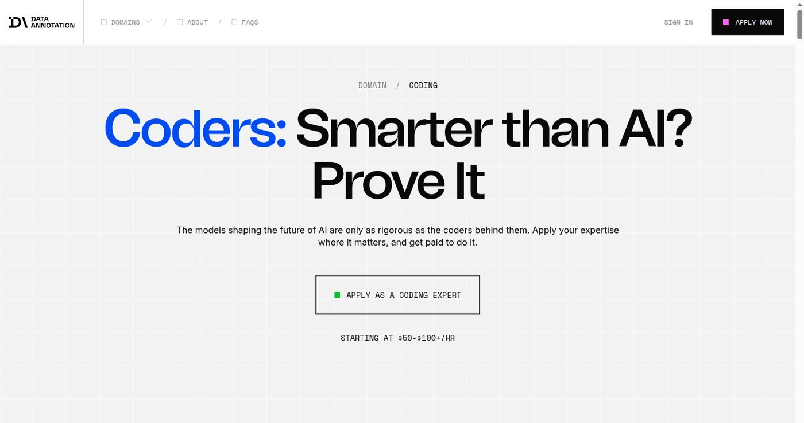

Outlier, DataAnnotation, Alignerr 같은 AI 트레이닝 플랫폼을 처음 봤을 때 솔직히 혹했다. 집에서 AI 답변을 평가하고 돈을 받는다니, 재택 부업으로 이보다 깔끔한 구조가 있나 싶었다. 그런데 가입 버튼을 누르기 전에 화면을 하나씩 열어보니 기대만큼 준비할 것도 많아 보였다. 공개 일감이 실제로 있는지, 심사는 어떻게 진행되는지, 한국어 작업이 가능한지, 전문 분야가 필요한지. 이걸 먼저 보지 않으면 기대치가 붕 뜬다.

미리 결론을 말하면 이렇다. 영어 지시문을 읽을 수 있고, 코딩이나 글쓰기처럼 보여줄 실력이 있고, 일이 열릴 때까지 다른 작업을 같이 준비할 수 있는 사람에게 맞는 일이다. 한국어 작업만 기다리는 전략은 약하다.

## Outlier: 공개 기회 화면부터 열어봤다

상단 대표 이미지는 Outlier 공개 기회 화면을 직접 캡처한 것이다. 2026년 6월 10일 캡처 기준으로 공개 기회 수가 0으로 표시됐다. 물론 이 숫자 하나로 플랫폼 전체를 판단할 수는 없다. 기회는 열렸다 닫혔다 한다. 다만 "가입하면 누구나 바로 시작한다"는 식의 소개글이 과장이라는 건 이 화면 하나로 충분히 알 수 있다.

Outlier에서 확인할 건 네 가지였다. 공개 기회가 보이는지(보이면 지원 경로와 조건), 한국어 작업이 있는지(계정 안 매칭까지 봐야 한다), 영어 작업이 가능한지(긴 지시문을 읽고 평가할 수 있는지 스스로 판단), 그리고 전문 분야가 있는지(글쓰기, 코딩, 번역, 사실 검증으로 나뉜다). 가입 화면이 열려 있어도 실제 작업 배정까지는 시간이 걸리기도 한다. 그 사이에 블로그 글이나 평가 샘플, 포트폴리오를 준비해두면 기다리는 시간이 덜 아깝다.

## DataAnnotation: 코딩을 할 줄 알면 다르게 보인다

[DataAnnotation](https://www.dataannotation.tech/) 공식 페이지에는 코딩 전문가 지원과 시간당 단가 문구가 같이 표시된다. 비전공자가 불가능하다는 뜻은 아니지만, 코딩 작업을 노릴수록 준비물이 늘어난다.

영어 지시문 읽기는 기본이고, 여기에 Python이나 JavaScript 기본기까지 있으면 받을 수 있는 작업이 확 늘어난다. 그리고 의외로 중요한 게 하나 있는데, "코드를 조금 만질 수 있다"와 "모델 답변의 오류를 말로 설명할 수 있다"는 다른 능력이라는 점이다. 이런 플랫폼의 코딩 작업은 후자를 요구하는 경우가 많다. 코딩 작업을 노린다면 작은 GitHub 프로젝트와 README를 정리해두고, 코드의 문제를 설명하는 연습을 같이 하는 게 좋다.

_출처: [DataAnnotation](https://www.dataannotation.tech/) 화면 직접 캡처_

## DataAnnotation 심사 준비 방법

DataAnnotation은 가입 후 바로 작업이 배정되지 않고 심사 단계를 거친다. 코딩 평가 작업을 지원한다면, 심사에서 요구하는 것은 코드를 짜는 능력보다 주어진 코드가 왜 잘못됐는지 설명하는 능력인 경우가 많다.

심사 준비라면 이런 연습이 실제로 도움이 된다. 공개된 코드 스니펫에서 오류를 찾아 왜 오류인지 영어로 설명해본다. ChatGPT나 Gemini가 만든 코드에서 잘못된 부분을 짚어 영어로 피드백을 적어본다. Stack Overflow의 비슷한 질문과 답변을 영어로 읽으며 표현을 익혀둔다. 이런 연습을 해두면 심사 통과 가능성이 올라간다. 코딩 작업이 목표가 아니라면, 글쓰기·번역·사실 검증 쪽으로 지원 분야를 좁히는 게 맞다.

## Alignerr: 전공자형 부업에 가깝다

[Alignerr](https://www.alignerr.com/) 공개 홈에는 평균 단가, AI 인터뷰, 도메인별 전문가 모집 문구가 나온다. 이 화면만 봐도 단순 반복 작업보다 전문 분야 평가에 가까운 플랫폼이라는 인상을 받았다. 언어·번역 경험자라면 문장 평가 샘플을, 개발 경험자라면 코드 리뷰식 설명을, 수학·과학 전공자라면 풀이 과정 설명을 준비해야 한다. 법률·의료 같은 분야는 자격과 표현 제한도 따로 확인이 필요하다.

한마디로 "남는 시간에 클릭하는 일"이 아니라 "내 전문성을 짧게 증명하는 일"에 가깝다. 전공이나 업무 경험이 있다면 오히려 기회고, 없다면 다른 플랫폼이 맞을 수 있다.

## Mindrift, 그리고 공통적으로 따져볼 것

[Mindrift](https://www.mindrift.ai/) 같은 플랫폼도 작업별로 나눠 보면 이해가 쉽다. 같은 AI 트레이닝이라도 어떤 일은 글을 읽고 비교하는 수준이고, 어떤 일은 특정 분야 지식이 필요하다.

플랫폼을 비교할 때 단가만 보면 함정에 빠진다. 화면에 적힌 시간당 단가가 높아 보여도 심사 시간이 길거나 일감이 불규칙하면 실제 월수입은 작게 끝난다. 반대로 단가가 낮아도 작업이 꾸준하고 실력에 맞으면 연습용으로 의미가 있다. 단가 옆에 항상 심사 시간, 일감 빈도, 언어 조건, 정산 방식(환율·수수료·세금 기록)을 같이 놓고 봐야 한다.

## 플랫폼 비교표

네 플랫폼을 확인하고 나서 정리한 비교표다.

| 플랫폼 | 언어 조건 | 전문 분야 필요 여부 | 일감 현황(2026.06 기준) |
| --- | --- | --- | --- |
| Outlier | 영어 기본, 한국어 작업별 상이 | 작업 유형에 따라 다름 | 공개 기회 0 (변동 있음) |
| DataAnnotation | 영어 지시문 필수 | 코딩·사실 검증은 실력 증명 필요 | 코딩 작업 위주 |
| Alignerr | 영어 기본 | 전공·도메인 경험 우대 | 전문가 매칭 방식 |
| Mindrift | 작업별 상이 | 작업에 따라 다름 | 작업 유형 다양 |

## 한국어 작업은 어디서 찾나

여러 플랫폼에서 한국어 작업을 찾으려면, 가입 후 계정 내 설정에서 언어 선호도를 한국어로 설정해두는 게 첫 번째다. 그다음으로 플랫폼 내 작업 목록에서 "Korean" 또는 언어 태그가 붙은 항목을 필터링한다.

현실적으로 한국어 전용 작업은 많지 않다. 영어로 된 지시문을 읽고 작업 내용은 한국어로 처리하는 방식이 더 일반적이다. 따라서 영어 지시문을 어느 정도 해독할 수 있어야 한국어 작업도 받는다. 영어가 약하다면 이 점을 미리 감안하고 플랫폼 선택 전략을 세워야 한다.

## 지원 전에 준비해둔 것

여러 화면을 보고 나서 지원 전 준비물을 이렇게 정리했다. 영어 자기소개(지원서와 프로필용), 언어·코딩·글쓰기·전문 분야를 구분한 작업 가능 분야 표, AI 답변 평가 샘플(심사 연습 겸 포트폴리오), GitHub나 블로그 링크(결과물 증거), 그리고 작업 시간과 입금 내역을 남길 정산 기록표.

## 정산 방식과 세금 처리

AI 트레이닝 플랫폼은 대부분 달러 기준으로 수입이 생긴다. PayPal이나 직접 계좌이체로 수령하는데, 환전 수수료와 환율이 실제 수령액에 영향을 미친다. 또한 해외 플랫폼 수입은 국내 종합소득세 신고 대상이 되기도 한다. 수입이 일정 규모 이상 누적되면 세금 처리 방법을 미리 파악해두는 게 좋다. 입금 내역을 월별로 따로 기록해두면 나중에 정리할 때 훨씬 쉽다.

## 마지막 질문이 사실 제일 중요했다

이 플랫폼 하나에 시간을 몰아도 되는가. 내 답은 아니오였다. 일감이 열리는 시기를 내가 통제할 수 없기 때문이다. 그래서 플랫폼에 지원하면서 남는 자산을 따로 만든다. 일이 오면 하고, 없을 때는 블로그 글이나 평가 샘플, GitHub 링크처럼 차곡차곡 쌓이는 증거를 모은다. 재택 AI 부업은 한 플랫폼에 기대기보다 작은 증거를 여러 개 쌓는 쪽이 안정적이다. 이 비교 과정 자체가 애드센스 블로그 글감이 된 것처럼.

플랫폼 지원과 블로그 글을 동시에 굴리는 30일 운영 구조는 [AI 부업 30일 운영표](/posts/ai-side-hustle-30-day-timetable/)에서 이어간다. 포트폴리오를 어떻게 준비하면 좋을지는 [AI 부업 포트폴리오 글](/posts/ai-side-hustle-proof-portfolio/)에 정리했다.

참고한 공식 화면: [Outlier](https://outlier.ai/), [DataAnnotation](https://www.dataannotation.tech/), [Alignerr](https://www.alignerr.com/), [Mindrift](https://www.mindrift.ai/)
