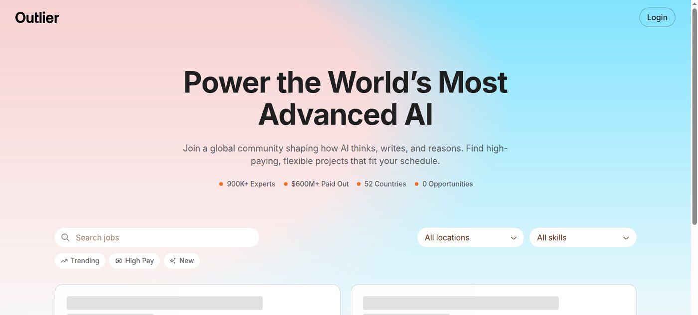
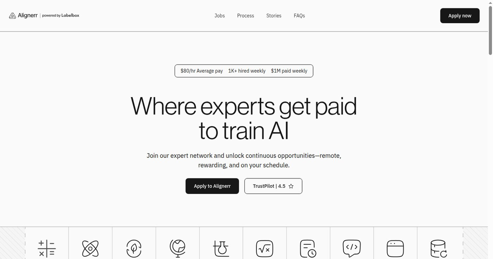

Outlier 같은 AI 트레이닝 플랫폼은 재택 부업 후보로 자주 거론된다. 집에서 할 수 있고, AI 학습 데이터나 평가 작업을 맡는다는 설명도 그럴듯하다. 하지만 한국인이 보기에는 먼저 확인해야 할 것이 많다.

이 글은 플랫폼을 추천하는 글이 아니다. Outlier, DataAnnotation, Alignerr, Mindrift를 볼 때 어떤 순서로 판단할지 정리한 글이다. 특히 "가입하면 바로 돈을 번다"는 식으로 보지 않으려고 한다. 이런 플랫폼은 심사와 대기 시간이 있고, 지역과 전문 분야에 따라 체감이 크게 달라진다. ⚠️

| 먼저 볼 기준 | 확인할 질문 |
| --- | --- |
| 일감 | 지금 공개 기회나 모집 분야가 보이는가 |
| 언어 | 한국어 작업이 있는가, 영어 작업도 가능한가 |
| 심사 | 테스트나 인터뷰를 통과해야 하는가 |
| 전문성 | 코딩, 법률, 의료, 수학 같은 분야가 필요한가 |
| 정산 | 지급 방식과 기록 관리가 가능한가 |

## 🔎 먼저 볼 것은 일감이다

플랫폼 비교에서 가장 먼저 보는 것은 이름값이 아니라 현재 보이는 일감이다. 아래는 Outlier 공개 기회 화면이다. 2026년 6월 10일 캡처 기준으로 공개 기회 수가 0으로 표시됐다. 이 숫자 하나만으로 플랫폼 전체를 판단할 수는 없지만, "지금 당장 누구나 들어가서 바로 시작한다"는 식으로 말하기는 어렵다.

_참고자료 사진: 플랫폼 비교 글은 현재 보이는 모집 화면부터 확인해야 과장을 줄일 수 있다._

Outlier를 볼 때는 일감보다 심사 구조를 먼저 이해해야 한다. 공개 기회가 보이지 않아도 계정 안에서 별도 매칭이 생길 수 있고, 분야별 평가를 통과해야 할 수도 있다. 반대로 가입은 했지만 대기 시간이 길어질 수도 있다.

| Outlier를 볼 때 질문 | 내 기준 |
| --- | --- |
| 공개 기회가 보이는가 | 안 보이면 바로 수익 기대 금지 |
| 한국어 작업이 있는가 | 계정 안 매칭까지 확인 필요 |
| 영어 작업이 가능한가 | 읽기와 평가가 부담 없는지 먼저 판단 |
| 전문 분야가 있는가 | 글쓰기, 코딩, 번역, 사실 검증을 나눠 보기 |

## 💻 DataAnnotation은 코딩 여부가 갈린다

DataAnnotation은 코딩 가능자에게 더 선명하게 보인다. 공식 페이지에는 코딩 전문가 지원과 시간당 단가 문구가 함께 표시된다. 비전공자가 무조건 못 한다는 뜻은 아니지만, 코딩 작업이 가능한 사람에게 기회가 더 뚜렷하게 보인다.

_참고자료 사진: 코딩 작업은 단순 클릭형 부업과 다르게 설명 능력까지 필요하다._

| 준비할 것 | 이유 |
| --- | --- |
| 영어 작업 읽기 | 지시문과 평가 기준을 이해해야 함 |
| Python 또는 JavaScript 기본기 | 코딩 작업 후보가 더 분명해짐 |
| 작은 GitHub 프로젝트 | 문제 해결 과정을 보여주기 좋음 |
| 코드 설명 연습 | 모델 답변의 오류를 설명해야 할 수 있음 |

코드를 조금 수정하는 수준과, 모델 답변의 오류를 찾아 설명하는 수준은 다르다. 개발 공부를 조금 했다는 이유만으로 바로 지원하면 테스트에서 막힐 수 있다. 코딩이 가능하다면 플랫폼 지원과 별개로 GitHub 포트폴리오도 같이 준비하는 편이 낫다.

## 🧠 Alignerr는 전공자형에 가깝다

Alignerr는 공개 홈 화면에서 평균 단가, AI 인터뷰, 도메인별 전문가 모집 문구를 보여준다. 이 화면만 봐도 단순 클릭 작업보다는 전문 분야 평가에 가까운 플랫폼이라는 인상을 받는다.

_참고자료 사진: 평균 단가보다 먼저 어떤 도메인 전문가를 찾는지 확인해야 한다._

| 맞을 가능성이 있는 사람 | 먼저 준비할 것 |
| --- | --- |
| 언어·번역 경험자 | 문장 평가 샘플 |
| 개발 경험자 | 코드 리뷰식 설명 |
| 수학·과학 전공자 | 풀이 과정 설명 |
| 법률·의료 등 전문 분야 경험자 | 자격, 경력, 표현 제한 확인 |

이런 플랫폼은 누구에게나 쉬운 부업으로 소개하면 안 된다. 전공이나 업무 경험이 있는 사람에게는 맞을 수 있지만, 아무 준비 없이 들어가면 심사에서 막힐 가능성이 높다. 한국어 작업을 기대하더라도 실제로 어느 시점에 어떤 작업이 열리는지는 따로 확인해야 한다.

## 🧩 Mindrift는 역할을 나눠 봐야 한다

Mindrift는 초급형과 전문가형을 나눠 봐야 한다. 플랫폼마다 모집하는 역할이 다르고, 같은 AI 트레이닝 작업이라고 해도 실제 난이도는 다르다. 어떤 작업은 글을 읽고 평가하는 수준이고, 어떤 작업은 특정 분야 지식이 필요하다.

| 비교 항목 | 낮게 보면 안 되는 이유 |
| --- | --- |
| 단가 | 심사 시간과 대기 시간을 같이 봐야 함 |
| 일감 | 항상 열려 있지 않을 수 있음 |
| 언어 | 한국어만으로는 기회가 제한될 수 있음 |
| 전문성 | 분야별 테스트가 있을 수 있음 |
| 정산 | 기록과 환율, 세금 처리가 필요함 |

단가만 보면 판단이 흐려진다. 시간당 단가가 높아 보여도 심사 시간이 길거나 일감이 불규칙하면 실제 월수입은 작을 수 있다. 반대로 단가가 낮아도 작업이 꾸준하고 자기 실력과 맞으면 연습용으로는 의미가 있다.

## 📌 내 기준의 순서

한국인 기준으로는 아래 순서로 본다.

| 순서 | 확인할 것 |
| --- | --- |
| 1 | 공개 화면에서 모집이나 기회가 보이는지 |
| 2 | 한국어 또는 영어 작업이 가능한지 |
| 3 | 심사 방식과 필요한 전문성이 무엇인지 |
| 4 | 정산 방식과 기록 관리가 가능한지 |
| 5 | 이 플랫폼 하나에 시간을 몰아도 되는지 |

대부분의 경우 답은 마지막에서 갈린다. 플랫폼 하나에만 기대는 것은 위험하다. 코딩이나 전문 분야가 있다면 DataAnnotation과 Alignerr 같은 후보를 같이 보고, 동시에 블로그 글과 포트폴리오를 쌓는 편이 낫다.

지원 전에 만들 준비물도 있다.

- 영어 자기소개와 작업 가능 분야
- GitHub나 블로그에 올린 작은 결과물
- AI 답변을 평가하는 짧은 샘플
- 코딩 작업을 노린다면 작은 프로젝트와 README
- 정산과 세금 기록을 남길 표

## 🔗 플랫폼 글도 블로그 자산이 된다

플랫폼 지원 결과가 바로 돈으로 이어지지 않아도 비교 과정은 블로그 글감이 된다. Outlier 공개 기회가 비어 있을 때 어떻게 판단할지, DataAnnotation 코딩 작업을 준비하려면 어떤 샘플이 필요한지, Alignerr 같은 전문가형 플랫폼은 누구에게 맞는지 각각 글로 나눌 수 있다.

내 판단은 이렇다. Outlier 같은 플랫폼은 확인해볼 만하지만 거기에만 기대면 안 된다. 일이 오면 하고, 일이 없을 때도 남는 자산을 만들어야 한다. 재택 AI 부업은 결국 하나의 플랫폼보다 여러 개의 작은 증거를 쌓는 쪽이 안전하다.
