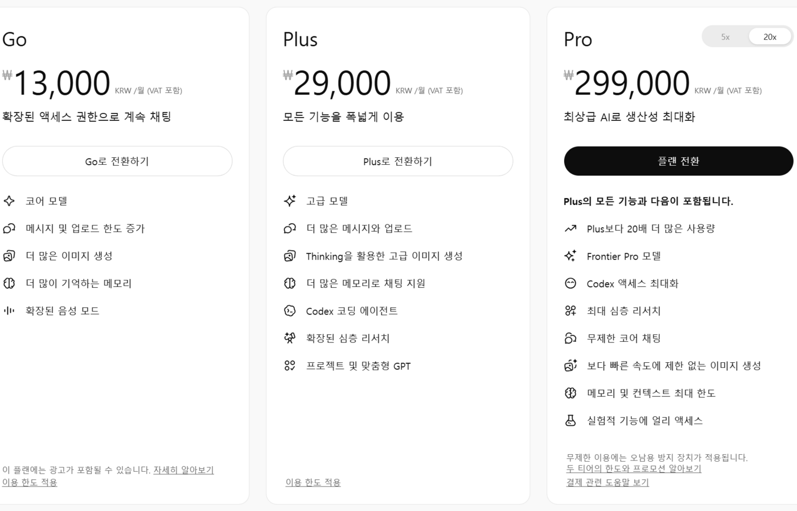

가격과 플랜 구성은 2026년 6월 14일 OpenAI 공식 페이지 기준이다. AI 도구 요금제는 자주 바뀌니 결제 전에 공식 가격 페이지를 다시 확인하자.

블로그를 운영하다 보면 ChatGPT 결제 화면 앞에서 한 번은 멈추게 된다. 무료로도 되는 것 같은데, 유료로 가면 뭐가 달라지나. 이 글은 기능 비교가 아니라 돈 계산이다. 블로그 운영자 기준으로 월 구독료가 남는 경우와 아닌 경우를 나눠본다.

_출처: OpenAI ChatGPT 가격 페이지 화면 캡처(사용자 제공, 2026-06-14)_

## 플랜 구성부터

ChatGPT는 발행일 기준 Free, Go, Plus, Pro에 업무용 Business, Enterprise까지 플랜이 나뉘어 있다. 개인 블로그 운영자가 고민하는 구간은 사실상 Free냐 Plus냐다. Pro 이상은 사용량이 직업 수준인 사람의 영역이라 이 글에서는 다루지 않는다.

달러 결제라는 점도 계산에 넣어야 한다. 환율과 세금에 따라 카드 청구액은 표시 가격보다 올라간다. "월 2만 원쯤"이라고 어림하지 말고 본인 카드 명세서 기준으로 따지자.

## 결제 전에 물어야 할 질문은 하나다

이 돈을 내고 줄어드는 시간이 얼마인가. 블로그 운영자의 작업을 쪼개보면 이렇다.

| 작업 | 무료로 충분한가 |
| --- | --- |
| 글감 아이디어, 제목 후보 뽑기 | 충분하다 |
| 목차 초안, 문단 구조 잡기 | 충분하다 |
| 주 1~2회 발행하는 글 초안 | 대체로 충분하다 |
| 매일 발행하는 글 초안 + 퇴고 | 무료 한도에 걸리기 시작한다 |
| 키워드 조사, 경쟁 글 분석을 매일 돌리는 루틴 | 한도와 속도가 병목이 된다 |
| 원고 대행처럼 남의 글까지 쓰는 경우 | 유료 없이는 일정이 흔들린다 |

기준은 발행 빈도다. 주 1~2회 발행이면 무료 한도 안에서 시간이 좀 더 들 뿐 일이 막히지는 않는다. 매일 발행하거나, 내 블로그에 더해 원고 대행 일감까지 받는 단계라면 한도에 막혀 작업이 끊기는 비용이 구독료를 넘어선다.

## 회수 계산: 시간을 돈으로 바꿔보기

계산 틀은 간단하다.

월 절약 시간 × 내 시간의 가치 > 월 구독료(환율 포함)

예를 들어 글 한 편 초안과 퇴고에서 1시간을 줄이고 월 12편을 발행한다면 12시간이다. 내 시간을 시급 1만 원으로만 쳐도 12만 원어치라 구독료를 넘는다. 반대로 월 4편 발행에 편당 30분 절약이면 2시간, 구독료와 비슷하거나 밑돈다. 이 계산이 안 나오면 결제를 미루는 게 맞다.

한 가지 함정이 있다. "유료로 바꾸면 글을 더 쓰겠지"라는 기대로 결제하는 경우다. 도구는 작업량을 만들어주지 않는다. 지금 무료 한도가 실제로 모자라서 막히는 사람만 회수가 된다.

## 결제가 남는 사람, 아닌 사람

남는 사람은 이렇다. 매일 발행 루틴이 돌아가고 있거나, 원고 대행·상세페이지 같은 납기 있는 일감을 받고 있거나, 키워드 조사를 매일 돌려서 한도가 실제로 마르는 사람.

아닌 사람도 분명하다. 발행이 주 1~2회 이하인 사람, 아직 블로그 방향을 잡는 중이라 글보다 고민이 많은 사람, 그리고 이미 다른 AI 구독을 쓰고 있는 사람. 마지막 경우는 두 개를 결제하기 전에 [Claude vs ChatGPT vs Gemini 비교 글](/posts/claude-chatgpt-gemini-writing-side-hustle/)에서 하나로 줄일 여지가 있는지 먼저 보자.

_출처: OpenAI ChatGPT 가격 페이지 화면 캡처(사용자 제공), [Claude 가격](https://claude.com/pricing), [Google AI 플랜](https://one.google.com/about/google-ai-plans/) 화면 직접 캡처_

키워드 조사에 AI를 쓰는 구체적인 방법은 [애드센스 키워드 조사 글](/posts/adsense-keyword-research-ai-side-hustle/)에서 다뤘다. 무료 한도로 그 루틴을 먼저 돌려보고, 막히는 지점이 오면 그때 결제해도 늦지 않다.

## 공식 확인처

- OpenAI ChatGPT 가격: https://openai.com/chatgpt/pricing/

가격과 플랜은 발행일 기준이며 수시로 바뀐다. 결제 화면에서 보이는 금액이 최종 기준이다.
