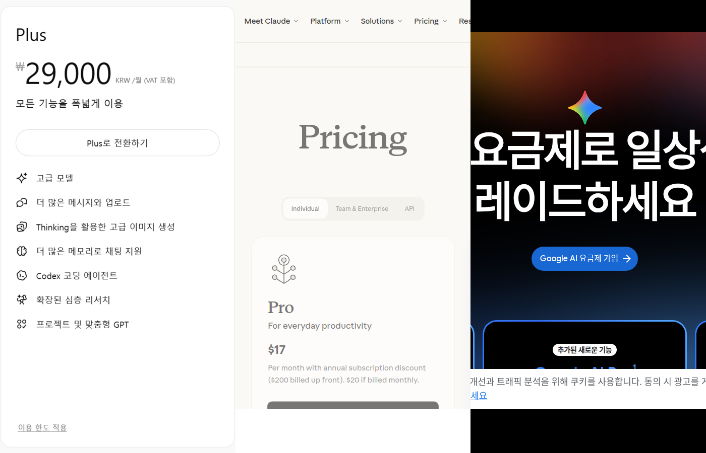
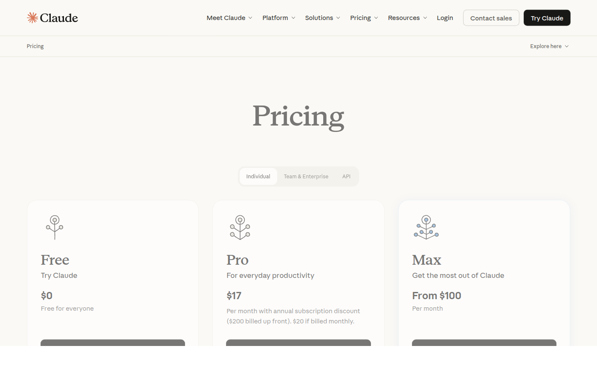
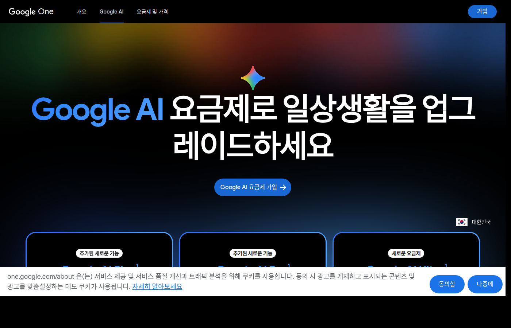

플랜 구성과 가격은 2026년 6월 14일 각 사 공식 페이지 기준이다. 세 도구 모두 요금제와 기능이 자주 바뀌니 결제 전에 공식 페이지를 다시 확인하자.

글쓰기 부업을 시작하면 셋 중 뭘 구독할지 고민하게 된다. 블로그 원고 대행, 상세페이지 문구, 전자책, 숏폼 대본 같은 한국어 글 작업 기준으로 정리한다. 미리 적어두면, 셋 다 결제하는 건 거의 항상 손해다. 하나를 고르는 글이다.

_출처: OpenAI ChatGPT 가격 페이지 화면 캡처(사용자 제공), [Claude 가격](https://claude.com/pricing), [Google AI 플랜](https://one.google.com/about/google-ai-plans/) 화면 직접 캡처_

## 플랜과 가격 구조

| 도구 | 무료 | 유료 시작점 |
| --- | --- | --- |
| ChatGPT | Free | Go, Plus, Pro 순으로 올라감 |
| Claude | Free | Pro 월 20달러(월 결제 기준), 위로 Max, Team |
| Gemini | Free | AI Plus, AI Pro, AI Ultra 계열 |

셋 다 무료 구간이 있고, 개인 유료는 월 20달러 안팎에서 시작하는 구조가 비슷하다. 그래서 가격으로는 승부가 안 나고, 내 작업과의 궁합으로 갈린다.

_출처: [Claude 가격](https://claude.com/pricing) 화면 직접 캡처_

_출처: [Google AI 플랜](https://one.google.com/about/google-ai-plans/) 화면 직접 캡처_

## 작업 유형별로 가르는 게 빠르다

세 도구를 같은 작업에 며칠씩 써보면서 느낀 차이를 작업 기준으로 나눴다.

**긴 한국어 원고를 다듬는 일이 많다면 Claude 쪽이 편했다.** 원고 대행이나 전자책처럼 수천 자짜리 글의 톤을 유지하면서 고쳐 쓰는 작업에서 손이 덜 갔다. 문장을 다시 만지는 횟수가 줄면 그게 곧 시간이다.

**검색 조사와 글쓰기를 한 화면에서 오가고 싶다면 ChatGPT가 무난했다.** 글감 조사, 제목 후보, 초안까지 흐름을 끊지 않고 가는 범용성이 강점이다. 사용자가 많아서 막혔을 때 한국어로 검색하면 해결법이 바로 나온다는 것도 실무에서는 무시 못 할 장점이다.

**구글 문서, Gmail, 스프레드시트 안에서 일한다면 Gemini가 유리하다.** 의뢰인과 구글 문서로 원고를 주고받거나 시트로 일정을 관리하는 사람은 작업하던 화면 안에서 AI를 부르는 동선이 제일 짧다. 도구가 좋아서가 아니라 동선이 짧아서 이기는 경우다.

## 한국어 글쓰기 작업별 체감 차이

실제 작업을 해보면 도구마다 한국어에 대한 감각이 조금씩 다르게 느껴진다.

Claude는 긴 문장을 자연스럽게 이어가는 편이고, 같은 지시를 여러 번 반복하지 않아도 문맥을 오래 기억해준다. 수천 자짜리 원고를 통째로 붙여넣고 고쳐달라고 해도 앞뒤 흐름이 잘 안 끊긴다. "딱딱한 느낌을 줄여달라"거나 "구어체로 바꿔달라"고 하면 결과가 들쭉날쭉하지 않고 비슷하게 나오는 편이었다.

ChatGPT는 제목 후보나 글감 아이디어를 빠르게 여러 개 뽑는 데 강하다. "이 주제로 블로그 제목 10개 뽑아줘"라는 요청을 가장 빠르고 다양하게 처리해줬다. 검색 기능이 붙은 플랜이라면 실시간 검색도 되니, 최신 정책이나 가격을 확인해야 하는 글감에서 쓸모가 있다.

Gemini는 구글 서비스와 붙어 있다는 게 핵심이다. 구글 문서에서 작업하다 바로 AI를 부를 수 있으니, 별도 창을 열지 않아도 되는데 이게 생각보다 일을 빠르게 만든다.

## 무료 구간에서 차이를 먼저 확인하는 게 맞다

세 도구 모두 무료 플랜이 있다. 결제 전에 같은 작업을 세 도구에 각각 해보는 게 가장 정확한 비교다.

추천하는 테스트 방법은 세 가지다. 첫째, 실제로 받을 가능성이 있는 의뢰 상황을 가정한 제목 후보를 각 도구에 뽑아보기. 둘째, 500자짜리 블로그 글 초안을 각각 만들어보고 한국어 자연스러움 비교하기. 셋째, 이미 쓴 글 한 단락을 각 도구에 붙여넣고 "더 자연스럽게 다듬어달라"고 요청한 결과 비교하기.

이 세 가지를 해보면 내 작업 방식과 맞는 도구가 어느 것인지 체감으로 알 수 있다. 기능 비교표나 리뷰를 읽는 것보다 훨씬 빠르다.

## 결정 순서

1. 지금 무료 플랜 셋을 같은 작업에 일주일씩 써본다. 결제는 그다음이다.
2. 내 부업에서 제일 시간이 많이 드는 작업 하나를 정한다. 초안인지, 퇴고인지, 조사인지.
3. 그 작업에서 다시 고치는 횟수가 가장 적었던 도구 하나만 결제한다.
4. 결제 후 한 달 뒤, 실제로 줄어든 시간을 확인하고 유지 여부를 정한다.

월 비용 회수를 계산하는 틀은 [ChatGPT 유료 결제 글](/posts/chatgpt-paid-plan-blogger-payback/)에 적어뒀다. 도구만 바꾸면 같은 계산이 그대로 적용된다.

## 구독 중에 주의할 것들

달러 결제라는 점은 세 도구 모두 같다. 환율이 올라가면 실제 카드 청구액이 늘어난다. 자동 갱신 방식이 대부분이라, 쓰지 않는 달에도 금액이 빠진다. 결제 후 한 달 뒤에 실제 사용량과 효과를 점검하는 루틴을 만들어두는 게 낫다.

도구를 구독한다고 자동으로 글의 질이 올라가지는 않는다. 도구는 초안을 빠르게 만들어주지만, 최종 검수는 결국 사람 몫이다. 특히 의뢰인에게 납품하는 글은 사실관계를 사람이 직접 확인해야 한다.

## 두 개 이상 결제를 고민하게 되는 시점

부업이 커지면 "초안은 이걸로, 퇴고는 저걸로" 같은 조합을 쓰고 싶어진다. 그 단계라면 월 구독료 합계가 부업 수익의 몇 퍼센트인지부터 보자. 도구 비용이 수익의 1~2할을 넘게 차지하면 도구가 아니라 단가나 작업량 문제일 가능성이 크다. 구독을 늘리는 건 지금 도구의 한도가 실제로 모자라서 일이 끊길 때 검토해도 충분하다.

달러 결제라 환율과 세금에 따라 청구액이 달라진다는 점, 그리고 어떤 도구든 의뢰인에게 납품하는 글은 사실 확인을 사람이 한다는 점은 셋 모두에 똑같이 적용된다. 원고 대행 작업의 범위 설정은 [블로그 원고 대행 글](/posts/ai-blog-writing-service-home-freelance/)에서 다뤘다.

## 공식 확인처

- OpenAI ChatGPT 가격: https://openai.com/chatgpt/pricing/
- Claude 가격: https://claude.com/pricing
- Google AI 플랜: https://one.google.com/about/google-ai-plans/

가격과 플랜 이름은 발행일 기준이고, 결제 화면의 금액이 최종 기준이다.
