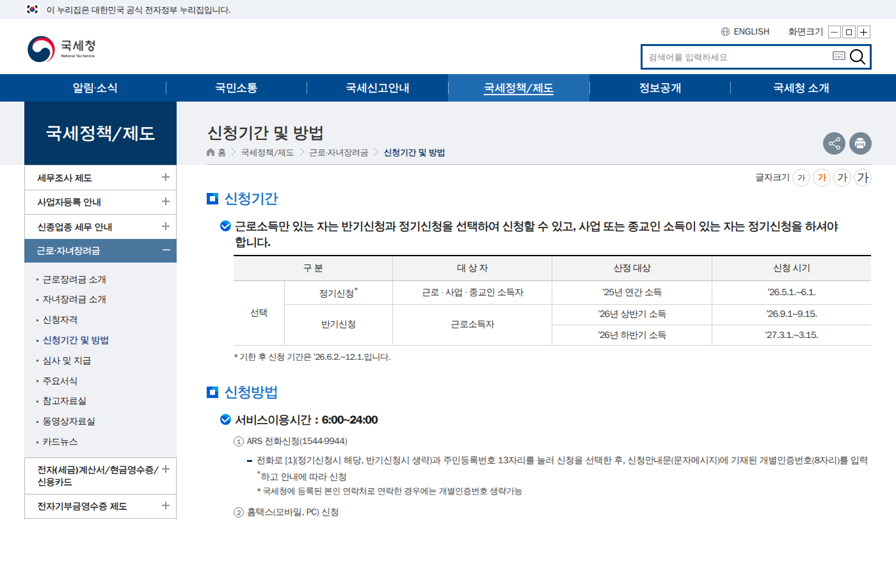
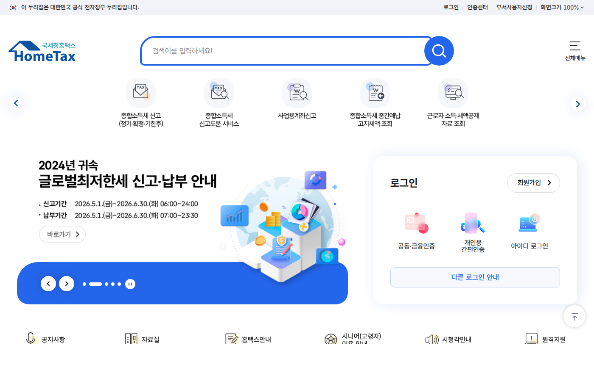

이 글은 2026년 6월 13일에 국세청 안내 페이지를 확인하고 정리했다. 개인별 자격 판정은 홈택스에서 본인 조건으로 확인하는 게 정확하다.

근로장려금 정기신청은 5월 1일부터 6월 1일까지였다. 이 글을 검색해서 들어왔다면 이미 그 기간이 지났을 가능성이 크다. 결론부터 적으면 아직 받을 길이 있다. 다만 금액이 줄어든다.

_출처: [국세청 근로·자녀장려금 안내](https://www.nts.go.kr/nts/cm/cntnts/cntntsView.do?cntntsId=238977&mi=40397) 화면 직접 캡처_

## 기한 후 신청: 6월 2일 ~ 12월 1일, 산정액의 95%

국세청은 정기신청 기간이 끝난 뒤에도 6월 2일부터 12월 1일까지 기한 후 신청을 받는다. 대신 산정된 장려금의 95%만 지급된다.

| 구분 | 기간 | 지급 |
| --- | --- | --- |
| 정기신청 | 5월 1일 ~ 6월 1일 | 100% |
| 기한 후 신청 | 6월 2일 ~ 12월 1일 | 95% |

5% 감액이 아까워서 신청 자체를 미루는 사람이 있는데, 순서가 거꾸로다. 기한 후 신청도 12월 1일이 지나면 그해 신청 기회가 사라진다. 95%라도 받는 것과 0원의 차이지, 95%와 100%의 차이가 아니다.

## 어떤 제도인지 다시 확인

근로장려금은 일은 하지만 소득이 적은 가구의 근로를 장려하고 실질소득을 지원하는 제도다. 자녀장려금은 같은 틀에서 자녀양육을 지원한다. 가구 구성, 소득 요건, 재산 요건을 따져서 산정되기 때문에 "나는 안 될 것"이라고 지레 판단하고 넘어가는 경우가 많다. 특히 이런 사람들이 자주 놓친다.

- 작년에 소득이 줄었거나 일을 쉬었던 사람
- 프리랜서, 플랫폼 노동, 단기 알바처럼 소득 신고가 들쭉날쭉한 사람
- 안내문을 못 받아서 대상이 아니라고 생각한 사람

안내문이 안 왔다고 대상에서 빠진 게 아니다. 자격 요건은 홈택스에서 본인 명의로 직접 확인하면 된다.

_출처: [홈택스](https://www.hometax.go.kr/) 화면 직접 캡처_

## 신청 경로는 여러 가지다

국세청 안내 기준으로 신청 경로는 다음과 같다.

- 홈택스 (PC·모바일)
- ARS 전화 신청
- 모바일 안내문에서 바로 신청
- QR 코드를 통한 신청
- 장려금 상담센터를 통한 대리 신청

홈택스가 익숙하지 않은 부모님 세대라면 상담센터 대리 신청 경로를 알려드리는 것만으로 도움이 된다. 본인 인증 수단만 준비되면 절차 자체는 길지 않다.

## 신청 전 체크리스트

- 작년(2025년) 소득 기준으로 판정된다는 점을 확인했는가
- 홈택스에서 신청 안내 대상인지 조회했는가
- 가구 유형(단독·홑벌이·맞벌이)이 어디에 해당하는지 확인했는가
- 재산 요건에 걸리는 항목(주택, 차량 등)이 없는지 따져봤는가
- 지급 계좌가 본인 명의인가

세부 요건 숫자는 해마다 조정되니 이 글에 박아두지 않는다. 홈택스 조회 화면이 보여주는 결과가 기준이다.

## 6월에 같이 챙길 것

근로장려금 기한 후 신청은 12월까지 여유가 있지만, 6월에는 기간이 짧은 일정이 두 개 더 있다. 청년미래적금은 6월 22일부터 7월 3일까지 2주뿐이고, 에너지바우처는 6월 15일에 신청이 열린다. 셋 다 해당될 수 있는 사람이라면 [6월 정부지원금 캘린더](/posts/june-2026-subsidy-calendar/)에서 날짜를 한 번에 확인하자.

## 공식 확인처

- 국세청 근로·자녀장려금 신청기간 및 방법: https://www.nts.go.kr/nts/cm/cntnts/cntntsView.do?cntntsId=238977&mi=40397
- 국세청 근로·자녀장려금 동영상자료실: https://www.nts.go.kr/nts/na/ntt/selectNttList.do?bbsId=50664&mi=7267

기간과 지급 비율은 발행일 기준 국세청 안내에 따른 것이다.
