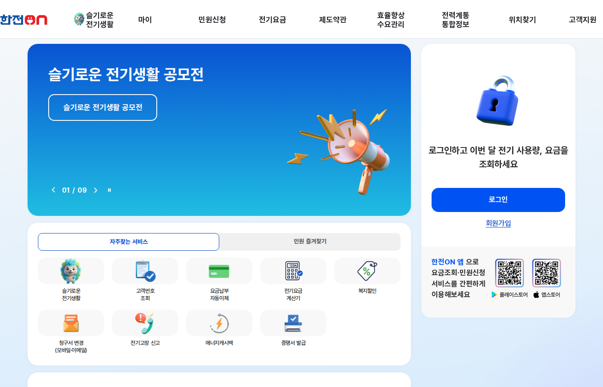

이 글은 2026년 6월 12일에 에너지바우처 공식 안내 페이지를 확인하고 정리했다. 지원 금액은 세대원 수와 연도에 따라 달라지니 신청 전에 공식 표를 다시 확인하자.

여름 전기요금 걱정이 시작되는 시점에 맞춰 에너지바우처 신청이 6월 15일에 열린다. 신청기간은 12월 31일까지로 길지만 하절기 지원은 여름 요금에 바로 차감되는 방식이라 일찍 신청할수록 이득이다. 사흘 뒤면 신청이 시작되니 오늘 대상인지부터 확인해두자.

## 대상: 두 가지 조건을 동시에 만족해야 한다

에너지바우처는 아무나 받는 지원이 아니다. 신청일 기준으로 두 가지를 모두 만족해야 한다.

| 조건 | 내용 |
| --- | --- |
| 소득 기준 | 기초생활수급 자격 |
| 세대원 특성 기준 | 노인, 영유아, 장애인, 임산부 등 세대원 특성 요건 |

둘 중 하나만 해당하면 대상이 아니다. 본인이 애매하다면 복지로의 모의계산으로 먼저 확인해보는 게 빠르다. 행정복지센터에 가서 헛걸음하는 것보다 낫다.

부모님이나 가까운 어르신 세대가 해당될 가능성도 같이 봐두자. 에너지바우처는 본인 신청 외에 담당 공무원 직권신청도 가능해서, 거동이 불편한 가족 대신 챙겨드리기 좋은 제도다.

## 세대원 특성 기준을 꼼꼼히 확인해야 하는 이유

소득 기준은 비교적 명확한 편이지만, 세대원 특성 기준은 생각보다 따져볼 것이 많다. "노인"이나 "장애인"이라는 단어를 보고 해당 없다고 판단하고 넘어가는 경우가 많은데, 실제로는 꽤 넓게 적용된다.

노인은 만 65세 이상이 기준이다. 가구에 그 나이의 가족이 있다면 세대원 특성 요건을 충족할 수 있다. 영유아는 보통 만 6세 미만, 임산부는 임신 중이거나 분만 후 일정 기간 이내인 경우를 가리킨다. 장애인은 등록 장애인이어야 한다. 이 중 한 명이라도 세대에 포함돼 있고 동시에 소득 기준도 충족된다면 신청 자격이 생긴다.

가족 중 어르신이 있거나 아이가 있는 기초수급 세대라면 반드시 확인해봐야 한다. 몰라서 놓치는 경우가 적지 않다.

## 신청 방법 세 가지

1. 주민등록상 거주지 행정복지센터 방문 신청
2. 담당 공무원 직권신청
3. 복지로 온라인 신청

온라인이 편한 사람은 복지로에서 끝내면 되고, 서류나 조건이 헷갈리면 행정복지센터에서 확인받으면서 신청하는 쪽이 안전하다.

방문 신청을 선택할 때는 본인 신분증을 꼭 챙겨야 한다. 대리 신청은 위임장과 대리인 신분증이 필요하다. 복지로 온라인 신청은 공동인증서나 간편인증 수단이 있으면 가능하고, 신청 이후 처리 상태도 복지로에서 확인할 수 있다.

담당 공무원 직권신청은 거동이 불편하거나 온라인이 어려운 분들을 위한 경로다. 신청자가 직접 요청하기도 하고, 지자체가 대상 가구를 파악해 먼저 연락하기도 한다. 주변에 혼자 사시는 어르신이 있다면 이 경로를 알려드리는 것만으로 도움이 된다.

## 하절기 바우처는 전기요금에서 그냥 빠진다

하절기 에너지바우처는 전기를 대상으로 한 요금차감 방식으로 신청한다. 카드를 들고 다니거나 어디서 결제할 필요 없이, 전기요금 고지서에서 지원 금액만큼 차감된다. 신청만 해두면 그 뒤로는 따로 챙길 일이 없다.

지원 금액은 세대원 수에 따라 다르고 연도별로 조정된다. 이 글에 금액 표를 박아두면 내년에 틀린 정보가 되니, 금액은 신청 시점에 공식 안내 페이지에서 확인하길 권한다.

전기요금 차감 방식이다 보니 이미 전기를 많이 쓴 달의 청구서에서도 차감이 된다. 바우처 한도 안에서 여름철 에어컨을 조금 더 편하게 틀 수 있는 셈이다.

## 동절기와 하절기 바우처는 별도로 적용된다

에너지바우처는 하절기(6~9월)와 동절기(10월~다음 해 5월)로 나뉜다. 하절기 바우처는 전기요금에서 차감되고, 동절기 바우처는 도시가스, 지역난방, 등유, 연탄, 전기 등 더 넓은 에너지원에 적용된다.

6월에 신청한다고 해서 여름분만 받는 게 아니다. 6월 15일부터 12월 31일까지가 신청기간이라 여름이 지나도 신청할 수 있다. 다만 하절기 지원을 여름 청구서에서 받으려면 6월 15일 이후 가능한 빨리 신청하는 편이 낫다. 전기요금은 사용 월이 아니라 청구서 발행 시점이 기준이 될 수 있어서, 신청 시점에 따라 적용 청구서가 달라질 수 있다.

## 신청 전 체크리스트

- 신청일 기준 기초생활수급 자격이 있는가
- 세대원 특성 기준에 해당하는 가족이 있는가
- 복지로 모의계산으로 대상 여부를 확인했는가
- 방문 신청이라면 신분증을 챙겼는가
- 전기요금 고지서가 본인 세대 명의로 나오는가
- 대리 신청이라면 위임장과 대리인 신분증이 준비됐는가

마지막 항목은 의외로 걸리는 사람이 있다. 요금차감 방식은 고지서 기준으로 적용되니, 명의 문제가 있다면 신청할 때 같이 문의하자.

## 중복 수혜 가능 여부

에너지바우처를 받는다고 다른 전기요금 지원이 자동으로 제외되지는 않는다. 지자체마다 별도 에너지 지원 사업을 운영하기도 하고, 복지부나 지자체 사업과의 중복 여부는 신청 창구에서 확인해야 한다. 복지로에 접속하면 본인이 받을 수 있는 다른 서비스도 같이 확인할 수 있으니, 에너지바우처 신청 화면을 열었을 때 주변 서비스도 둘러보자.

## 전기요금 줄이기는 바우처가 끝이 아니다

에너지바우처는 대상이 정해져 있는 제도다. 대상이 아니더라도 여름 전기요금은 사용량 확인과 냉방 설정으로 줄일 여지가 있다. 그 출발점은 한전ON에서 우리 집 사용량을 먼저 들여다보는 것이다.

냉방비를 줄이는 현실적인 방법은 에어컨 온도를 1도 높이는 것이다. 냉방 온도를 26도에서 27도로 바꾸는 것만으로 전기 소비가 눈에 띄게 줄어든다. 사용 시간도 중요한데, 피크 시간대(오후 2~5시)에 에어컨을 덜 돌리고 아침이나 저녁에 환기를 잘 해두면 전기요금을 낮추는 데 도움이 된다.

에어컨 필터를 한 달에 한 번 청소하는 것도 효율에 영향을 준다. 필터가 막히면 같은 온도를 유지하려고 전기를 더 쓴다.

_출처: [한전ON](https://online.kepco.co.kr/) 화면 직접 캡처_

6월에 일정이 걸린 다른 지원금은 [6월 정부지원금 캘린더](/posts/june-2026-subsidy-calendar/)에 모아뒀다.

## 신청 이후 확인 방법

신청 후에는 처리 결과를 복지로 마이페이지나 행정복지센터에서 확인할 수 있다. 방문 신청은 담당자가 처리 완료 후 연락을 주기도 한다. 온라인 신청이라면 복지로 로그인 후 신청 내역에서 승인 여부가 표시된다.

전기요금 차감이 언제부터 적용되는지는 신청 완료 후 한국에너지공단에서 한전으로 정보가 넘어가는 처리 일정에 따라 달라진다. 신청 직후 바로 다음 달 청구서부터 반영되기도 하고, 한 달 정도 늦게 반영되기도 한다. 차감이 시작되면 전기요금 청구서 하단에 "에너지바우처 지원" 항목으로 표시된다.

## 공식 확인처

- 에너지바우처 신청안내: https://www.energyv.or.kr/info/apl_info.do
- 복지로: https://www.bokjiro.go.kr/
- 한전ON 전기요금 조회: https://online.kepco.co.kr/

신청기간과 조건은 발행일인 2026년 6월 12일 기준이다.
