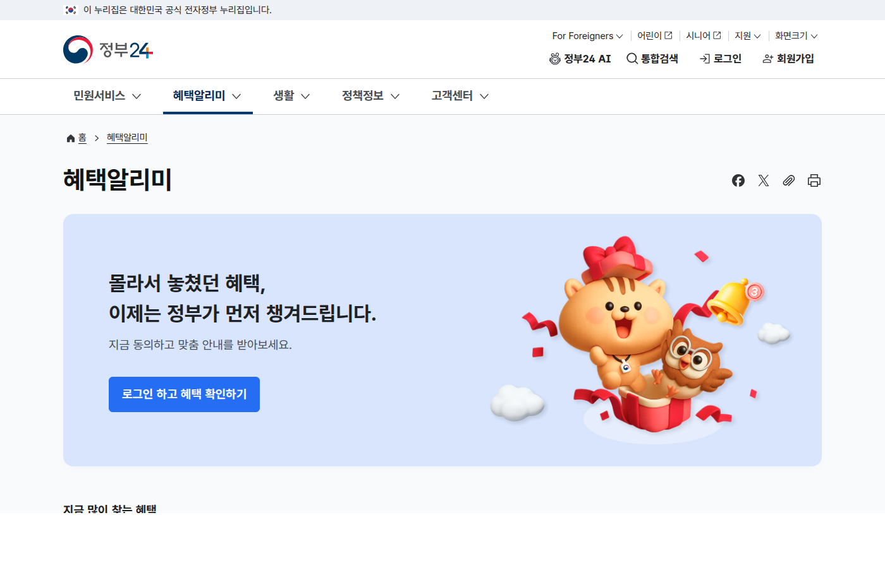
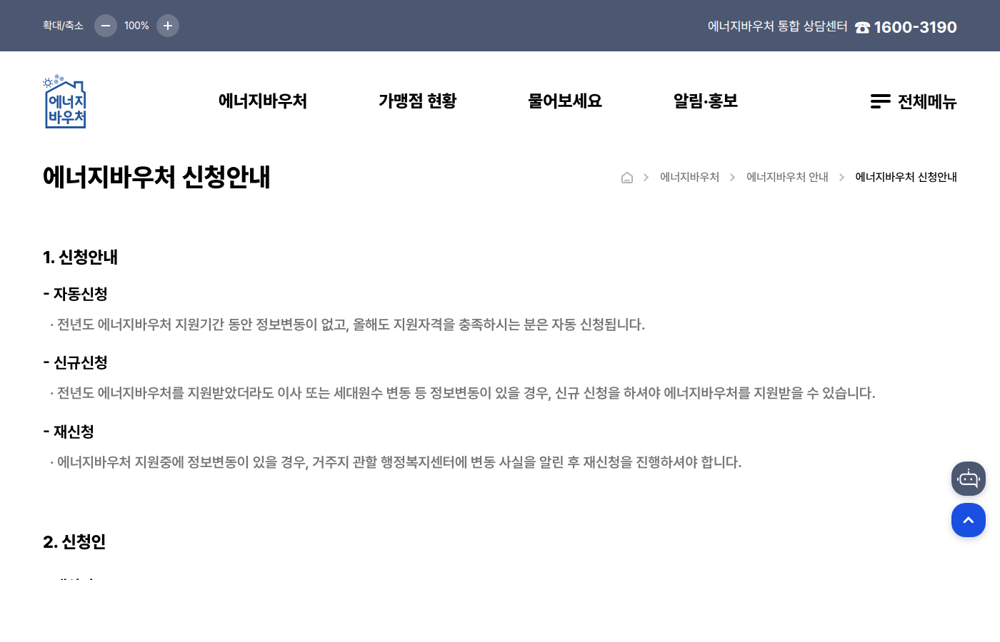

이 글은 2026년 6월 12일에 각 기관 공식 자료를 직접 열어보고 정리했다. 신청기간과 조건은 바뀔 수 있으니 신청 직전에 공식 사이트에서 한 번 더 확인하길 권한다.

지원금 글을 찾다 보면 제일 곤란한 게 날짜다. 어떤 글은 작년 기준이고, 어떤 글은 신청기간이 끝난 제도를 아직도 소개한다. 그래서 이번 달 안에 실제로 움직여야 하는 것만 날짜순으로 모았다. 6월에 일정이 걸려 있는 건 세 가지다.

_출처: [정부24 혜택알리미](https://plus.gov.kr/) 화면 직접 캡처_

## 6월 일정 한눈에 보기

| 날짜 | 제도 | 해야 할 일 |
| --- | --- | --- |
| 6월 2일 ~ 12월 1일 | 근로장려금 기한 후 신청 | 정기신청을 놓쳤다면 지금부터 신청 가능 |
| 6월 15일 ~ 12월 31일 | 에너지바우처 | 하절기 전기요금 지원, 6월 15일부터 신청 시작 |
| 6월 22일 ~ 7월 3일 | 청년미래적금 | 신청기간 2주, 첫 5영업일은 출생연도 5부제 |

하나씩 짚어본다.

## 근로장려금: 정기신청 놓쳤어도 12월 1일까지 받는다

2026년 근로장려금 정기신청은 5월 1일에 시작해 6월 1일에 끝났다. 여기서 끝이 아니다. 6월 2일부터 12월 1일까지는 기한 후 신청 기간이다. 다만 국세청 안내 기준으로 기한 후 신청은 산정된 장려금의 95%만 지급된다. 5%를 떼이는 건 아깝지만, 아예 못 받는 것보다는 낫다.

신청 경로는 홈택스, ARS, 모바일 안내문, 상담센터 대리 신청까지 여러 가지가 열려 있다. 자격 요건과 신청 방법은 [근로장려금 기한 후 신청 글](/posts/eitc-late-application-2026/)에 따로 정리했다.

_출처: [국세청 근로·자녀장려금 안내](https://www.nts.go.kr/nts/cm/cntnts/cntntsView.do?cntntsId=238977&mi=40397) 화면 직접 캡처_

## 에너지바우처: 6월 15일 신청 시작, 여름 전기요금에서 차감

2026년 에너지바우처 신청기간은 6월 15일부터 12월 31일까지다. 신청일 기준으로 기초생활수급 자격과 세대원 특성 기준을 둘 다 만족해야 한다. 하절기 바우처는 전기요금에서 차감되는 방식이라 따로 쓸 일 없이 고지서에서 빠진다.

신청은 행정복지센터 방문, 담당 공무원 직권신청, 복지로 온라인 신청이 가능하다. 대상 조건과 신청 순서는 [에너지바우처 신청 글](/posts/energy-voucher-summer-2026-apply/)에서 다뤘다.

_출처: [에너지바우처 신청안내](https://www.energyv.or.kr/info/apl_info.do) 화면 직접 캡처_

## 청년미래적금: 6월 22일 출시, 신청은 7월 3일까지 2주뿐

이번 달 일정 중에 기간이 제일 빡빡한 게 청년미래적금이다. 금융위원회 공시 기준으로 토스뱅크를 제외한 14개 기관이 6월 22일에 출시하고, 신청은 6월 22일부터 7월 3일까지 딱 2주다. 첫 5영업일인 6월 22일부터 26일까지는 출생연도 끝자리 5부제가 적용되니 자기 날짜를 미리 확인해야 한다.

조건은 월 최대 50만 원, 3년 자유적립식이고 이자소득 비과세에 정부기여금이 최대 12% 매칭된다. 기본금리 5%에 기관별 우대금리가 2~3% 붙는다. 가입 조건과 5부제 날짜는 [청년미래적금 신청 전 확인 글](/posts/youth-future-savings-checklist/)에, 3년 뒤 받는 금액 계산은 [만기금액 계산 글](/posts/youth-future-savings-maturity-calc/)에 나눠 적었다.

_출처: [금융위원회 청년미래적금 금리 공시](https://www.fsc.go.kr/no010101/87005) 화면 직접 캡처_

## 일정은 없지만 6월에 같이 확인해두면 좋은 것

보조금24와 복지로 복지멤버십은 신청 마감이 따로 없다. 대신 위 세 가지를 신청하러 정부24나 복지로에 들어간 김에 같이 확인해두면 좋다. 정부24 혜택알리미는 몰라서 놓친 혜택을 먼저 알려주는 서비스고, 복지멤버십은 가입해두면 조건에 맞는 복지서비스를 알아서 안내해준다. 지원금은 한 번 찾고 끝이 아니라 조회 루틴을 만들어두는 쪽이 남는다.

## 공식 확인처

- 국세청 근로·자녀장려금 안내: https://www.nts.go.kr/nts/cm/cntnts/cntntsView.do?cntntsId=238977&mi=40397
- 에너지바우처 신청안내: https://www.energyv.or.kr/info/apl_info.do
- 금융위원회 청년미래적금 금리 공시: https://www.fsc.go.kr/no010101/87005
- 정부24: https://plus.gov.kr/
- 복지로: https://www.bokjiro.go.kr/

날짜와 조건은 발행일인 2026년 6월 12일 기준이다. 신청 전에 위 공식 사이트에서 최신 공고를 확인하자.
