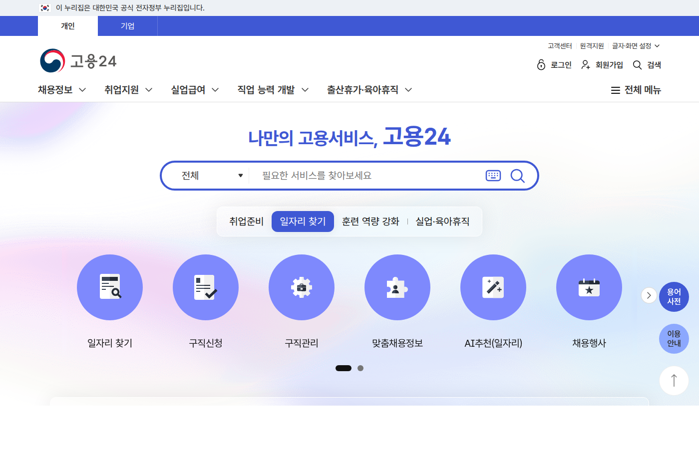

이 글은 2026년 6월 13일에 고용노동부 보도자료를 확인하고 정리했다. 과정별 모집 일정과 수당 조건은 훈련기관마다 다르니 HRD-Net에서 실제 공고를 확인해야 한다.

AI 부업이나 이직을 알아보다 보면 수십만 원짜리 AI 강의 결제 화면 앞까지 가게 된다. 나도 그 화면까지 가봤다. 그런데 결제 전에 확인할 게 있다. 비슷한 내용을 국비로, 그것도 수당을 받으면서 배우는 길이 열려 있다.

## KDT AI 캠퍼스가 뭔가

고용노동부가 2026년 KDT AI 캠퍼스 참여기관 44개소를 확정했고, 5월부터 수강생 모집이 시작됐다. 양성 목표 직군은 네 가지다.

- AI 엔지니어
- AI 어플리케이션 개발자
- AI 융합가
- AI 하드웨어 엔지니어

내일배움카드 발급자라면 누구나 참여 대상이고, 훈련비 전액 지원이 안내됐다. 여기까지면 "무료 강의" 수준인데, 한 가지가 더 붙는다.

## 수당까지 준다: 지역별로 월 최대 40만~80만 원

출석률에 따라 훈련수당이 지급된다. 고용노동부 안내 기준으로 지역별 상한이 다르다.

| 지역 | 월 최대 훈련수당 |
| --- | ---: |
| 수도권 | 40만 원 |
| 비수도권 | 60만 원 |
| 인구감소지역 | 80만 원 |

유료 강의는 내 돈이 나가는데, 이쪽은 교육비가 들지 않으면서 다달이 수당이 들어오는 구조다. 돈 관점에서만 보면 비교가 안 된다.

## 내일배움카드가 없다면 먼저 발급해야 한다

KDT AI 캠퍼스를 비롯해 국비 교육 대부분은 국민내일배움카드(내일배움카드)가 있어야 신청할 수 있다. 취업자, 재직자, 구직자 등 상황에 따라 발급 조건이 다르니 HRD-Net 홈페이지에서 본인에게 맞는 방법을 확인하자.

발급 신청은 HRD-Net 온라인 또는 가까운 고용센터 방문으로 가능하다. 발급까지 시간이 걸릴 수 있으니, 관심 있는 과정의 모집 일정보다 여유 있게 신청하는 게 낫다. 카드가 발급되면 계좌와 연결된 방식으로 훈련 비용이 처리된다.

## 그런데 누구에게나 맞는 건 아니다

여기서 글을 끝내면 광고와 다를 게 없다. KDT는 시간을 통째로 내는 과정이다. 유리한 사람과 아닌 사람이 갈린다.

KDT가 맞는 사람은 풀타임으로 몇 달을 교육에 쓸 여유가 있는 사람이다. 취업 준비생, 이직 준비 중 공백기가 있는 사람, 커리어를 개발 직군으로 트는 사람. 이런 경우 훈련비 지원과 수당이 공백기의 생활비 부담을 덜어준다.

반대로 직장이나 본업이 있는 사람에게는 풀타임 과정 자체가 성립하지 않는다. 이 경우에는 고용노동부의 STEP 온라인 직업교육 플랫폼이 대안이다. AI 관련 콘텐츠가 늘고 있으니 퇴근 후에 무료로 들을 만한 것부터 찾는 게 순서다. 부업 수준의 가벼운 활용이 목적이라면 몇 시간짜리 유료 강의보다 직접 만들어보면서 독학하는 쪽이 맞을 수도 있다.

## 과정을 고를 때 네 직군을 구분해서 봐야 한다

KDT AI 캠퍼스의 네 직군은 실제로 꽤 다른 방향이다. AI 엔지니어와 AI 어플리케이션 개발자는 코딩이 기반이 되는 직군이고, AI 융합가는 특정 산업에 AI를 접목하는 방향이다. AI 하드웨어 엔지니어는 반도체나 엣지 디바이스 쪽에 가깝다.

본인이 어떤 방향으로 가고 싶은지에 따라 과정 선택이 달라진다. "AI를 배우고 싶다"는 막연한 목표로 과정을 고르면, 중반에 방향이 안 맞는다는 걸 느끼게 된다.

취업이 목표라면 수료생 취업 실적을 공개하는 기관의 과정을 선택하는 게 낫다. 훈련기관마다 취업률, 취업 직군, 연계 기업이 다르다. HRD-Net에서 기관 정보를 조회하면 이력과 수료 통계를 확인할 수 있는 경우가 있다.

## 신청 전 HRD-Net에서 확인할 것

KDT AI 캠퍼스라는 이름이 같아도 과정은 기관마다 다르다. 신청 전에 HRD-Net에서 실제 공고를 열어 다음을 확인하자.

- 모집 일정과 선발 방식
- 자비부담이 있는지
- 수당 지급 조건(출석률 기준)
- 커리큘럼이 네 직군 중 어디를 향하는지
- 수료생 취업 실적이 공개되어 있는지

"전액 지원"이라는 말만 보고 신청하면 과정 중반에 자기와 안 맞는 커리큘럼을 발견하게 된다. 몇 달짜리 과정은 돈이 아니라 시간이 비용이다.

_출처: [HRD-Net](https://www.hrd.go.kr/) 화면 직접 캡처_

## 훈련수당 지급 방식과 주의사항

훈련수당은 출석률을 충족해야 지급된다. 기관마다 기준이 다를 수 있지만, 일반적으로 80% 이상 출석이 조건이 되는 경우가 많다. 병가나 경조사 같은 결석은 출석으로 인정해주는 경우가 있으니 신청 전에 결석 처리 기준을 확인해두자.

수당은 매달 지급되는 구조가 아닌 경우도 있다. 과정 수료 후 일괄 지급이거나, 분기별 지급인 경우도 있다. 생활비 계획을 세울 때 수당 지급 일정을 미리 확인해두는 게 중요하다.

## 결제 전 판단 순서

1. 내일배움카드가 없다면 발급부터 (HRD-Net에서 신청)
2. KDT AI 캠퍼스 과정 중 내 지역, 내 직군 후보를 검색
3. 풀타임이 불가능하면 STEP 무료 온라인 강의 확인
4. 그래도 채워지지 않는 부분이 있을 때만 유료 강의 검토

유료 강의가 나쁘다는 게 아니다. 순서의 문제다. 무료와 국비로 채워지는 범위를 확인한 다음에 결제해도 늦지 않다.

AI 교육으로 익힌 걸 부업으로 연결하는 흐름은 [AI 부업 30일 운영표](/posts/ai-side-hustle-30-day-timetable/)에서 다뤘고, 유료 AI 도구 결제 판단은 [ChatGPT 유료 결제 글](/posts/chatgpt-paid-plan-blogger-payback/)에서 이어간다.

## 공식 확인처

- 고용노동부 KDT AI 캠퍼스 참여기관 확정 보도자료: https://www.moel.go.kr/news/enews/report/enewsView.do?news_seq=19240
- HRD-Net (국민내일배움카드·과정 검색): https://www.hrd.go.kr/

일정과 수당 조건은 발행일 기준이며, 과정별 세부 조건은 모집 공고가 우선한다.
