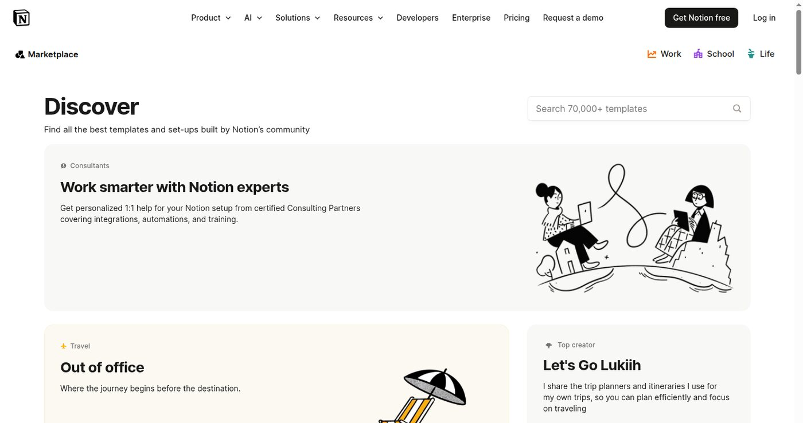

Notion이나 Canva 템플릿은 만들기 쉬워 보인다. AI에게 구조를 짜 달라고 하고, 제목과 예시 데이터를 넣고, 디자인을 조금 다듬으면 상품처럼 보인다. 문제는 그렇게 만든 템플릿이 실제로 팔리느냐다. 템플릿은 기능보다 사용 장면을 판다. 누가, 언제, 왜 이 파일을 열어야 하는지가 먼저 정해져야 한다.

한국어 템플릿은 특히 더 그렇다. 해외 템플릿을 번역한다고 바로 상품이 되지 않는다. 한국인이 쓰는 업무 방식, 학교 과제, 자격증 공부, 부업 기록, 쇼핑몰 운영, 전자책 판매 흐름이 있다. 말투와 항목 이름도 다르다. 그래서 템플릿 판매를 AI 부업으로 보려면 기능 목록보다 사용 장면을 먼저 잡아야 한다.

AI는 템플릿 초안을 만드는 데 도움이 된다. 표 구조를 만들고, 예시 데이터를 채우고, 체크리스트를 뽑고, 설명 문구를 만드는 일은 빠르게 할 수 있다. 하지만 AI가 만든 초안은 대부분 너무 일반적이다. "목표 관리", "일정 관리", "업무 생산성" 같은 넓은 이름으로는 구매 이유가 약하다. 템플릿은 더 좁아야 한다.

## 마켓 화면에서 사용 장면을 본다

템플릿 글에는 실제 마켓 화면이 필요하다. 아래는 Notion 공식 템플릿 마켓플레이스 화면이다. 검색창, 카테고리, 템플릿 카드가 보인다. 이 화면을 보면 템플릿이 기능별로만 팔리지 않는다는 것을 알 수 있다. 사람들은 일정표를 사는 것이 아니라 자기 상황에 맞는 작업 공간을 찾는다.

이 화면에서 봐야 할 것은 디자인보다 분류다. 어떤 템플릿이 업무용인지, 개인 관리용인지, 공부용인지, 프로젝트용인지 나뉜다. 한국어 상품을 만들 때도 같은 질문을 해야 한다. 누구의 어떤 상황을 돕는가. 직장인의 주간 업무 정리인지, 대학생의 과제 관리인지, 전자책 판매자의 업데이트 로그인지, AI 부업 블로그 운영표인지 먼저 정한다.

예를 들어 "AI 부업 관리 템플릿"은 아직 넓다. "Outlier 지원 기록과 정산 메모를 같이 남기는 표", "애드센스 블로그 30일 발행표", "전자책 업데이트 로그와 보너스 파일 관리표"처럼 좁히면 실제 사용 장면이 보인다. 좁은 템플릿은 구매자 수가 작을 수 있지만, 설명하기 쉽고 블로그 글로 연결하기도 좋다.

## 한국어 맥락은 번역이 아니다

해외 템플릿을 한국어로 바꿀 때 흔히 하는 실수는 단어만 번역하는 것이다. Habit tracker를 습관 추적기로 바꾸고, finance dashboard를 재무 대시보드로 바꾸는 식이다. 그런데 실제 구매자는 그런 번역어보다 자기 상황에 맞는 말을 원한다. "퇴근 후 1시간 부업 기록표", "전자책 판매 업데이트 로그", "스마트스토어 상품 문구 수정표"처럼 바로 쓰는 이름이 더 낫다.

한국어 템플릿은 입력 예시도 중요하다. 빈 표만 있으면 사용자가 직접 생각해야 할 것이 많다. 예시 행에 "CapCut 숏폼 대본 5개", "Gumroad 판매 페이지 수정", "크몽 상품 설명 문구 변경"처럼 실제 상황을 넣으면 사용법이 바로 보인다. AI는 이런 예시를 빠르게 만들어줄 수 있지만, 최종 예시는 사람이 골라야 한다. 너무 그럴듯한데 실제로 안 쓰는 말은 빼야 한다.

Canva 템플릿도 마찬가지다. 카드뉴스, 전자책 표지, 상세페이지 배너, 숏폼 썸네일처럼 사용 장면이 먼저다. Canva 화면을 자동 캡처하기 어려운 경우가 있어도 템플릿 판매 글은 쓸 수 있다. 중요한 것은 Canva라는 도구 이름이 아니라, 구매자가 어떤 결과물을 만들고 싶은지다. 카드뉴스라면 몇 장짜리인지, 어디에 올릴지, 어떤 문구를 바꿔 쓰는지까지 정해야 한다.

## AI가 만드는 것과 사람이 고치는 것

AI로 템플릿을 만들 때 사람 손이 필요한 부분은 분명하다. 첫째, 템플릿의 대상자를 좁힌다. 둘째, 항목 이름을 실제 한국어 사용 장면에 맞춘다. 셋째, 예시 데이터를 과장 없이 넣는다. 넷째, 설명 문구를 짧게 줄인다. 다섯째, 구매 후 바로 따라 할 수 있는 사용 순서를 적는다.

AI가 잘하는 일은 초안이다. 예를 들어 "전자책 업데이트 관리 템플릿"을 만들 때 AI에게 버전, 수정일, 수정 내용, 추가 파일, 다음 작업 같은 열을 제안하게 할 수 있다. 하지만 실제 판매용으로는 더 손봐야 한다. "수정 내용"보다 "구매자에게 알려야 할 변경"이 나을 수 있고, "추가 파일"보다 "보너스 파일"이 더 자연스러울 수 있다. 작은 단어가 사용감을 바꾼다.

디자인도 전부 화려할 필요는 없다. 템플릿은 예쁜 화면보다 계속 열어 쓰기 쉬운 구조가 중요하다. 색이 많고 섹션이 복잡하면 처음에는 좋아 보여도 오래 쓰기 어렵다. 특히 Notion 템플릿은 데이터베이스 이름과 보기 방식이 중요하다. Canva 템플릿은 글자 길이가 바뀌어도 깨지지 않는지가 중요하다.

## 크몽에서 수요를 같이 본다

템플릿 판매를 해외 마켓만 보고 판단하면 한국어 수요를 놓칠 수 있다. 아래는 크몽 공개 메인 화면이다. 전자책과 AI 서비스 카테고리에서 템플릿 상품 수요를 추정할 수 있다. 크몽에서는 템플릿이 전자책, 강의자료, 업무 자동화, 디자인 서비스와 같이 묶일 수 있다.

크몽 화면을 볼 때는 "템플릿"이라는 단어만 찾지 않는다. 사람들이 어떤 문제를 돈을 내고 해결하려는지 본다. 전자책 판매자는 표지와 판매 페이지 문구가 필요하다. 스마트스토어 판매자는 상세페이지 배너와 상품 설명 문구가 필요하다. 블로그 운영자는 발행표와 키워드 정리표가 필요하다. 프리랜서는 포트폴리오 페이지와 제안서 양식이 필요하다. 이 문제들이 템플릿 상품으로 바뀐다.

템플릿 상세페이지에는 미리보기, 사용 대상, 포함 파일, 수정 가능한 부분, 사용 순서, 업데이트 여부가 들어가야 한다. "예쁜 템플릿입니다"보다 "전자책 업데이트 로그를 10분 안에 정리하도록 만든 Notion 표입니다"가 더 낫다. 구매자는 아름다운 구조보다 자기 시간을 줄여줄 구조를 산다.

## 블로그 글과 연결한다

템플릿 판매는 블로그 글감으로 이어지기 좋다. "AI 부업 블로그 30일 발행표 만들기", "전자책 업데이트 로그 템플릿 구성", "숏폼 대본 관리표에 넣을 항목", "스마트스토어 상세페이지 문구 수정표" 같은 글을 쓸 수 있다. 이 글들은 템플릿의 사용법을 설명하면서 검색 유입을 만든다.

블로그 글에서 템플릿을 바로 팔려고만 하면 광고처럼 보인다. 대신 실제 문제를 먼저 풀어준다. 발행표가 왜 필요한지, 업데이트 로그를 왜 남겨야 하는지, 숏폼 대본을 왜 장면별로 나눠야 하는지 설명한다. 그다음 템플릿이 그 과정을 줄여주는 도구라고 보여준다. 이렇게 해야 글과 상품이 자연스럽게 이어진다.

Notion·Canva 템플릿 판매는 AI로 많이 만드는 게임이 아니다. 적게 만들더라도 사용 장면이 선명해야 한다. 한국어 사용자의 맥락을 보고, 실제 마켓 화면에서 수요를 확인하고, AI 초안을 사람 손으로 줄이고, 블로그 글로 사용법을 설명해야 한다. 템플릿은 파일이 아니라 반복되는 상황을 줄여주는 도구다. 그 상황을 먼저 잡아야 팔 수 있다.

참고한 공개 화면: [Notion Templates](https://www.notion.com/templates), [크몽](https://kmong.com/)
