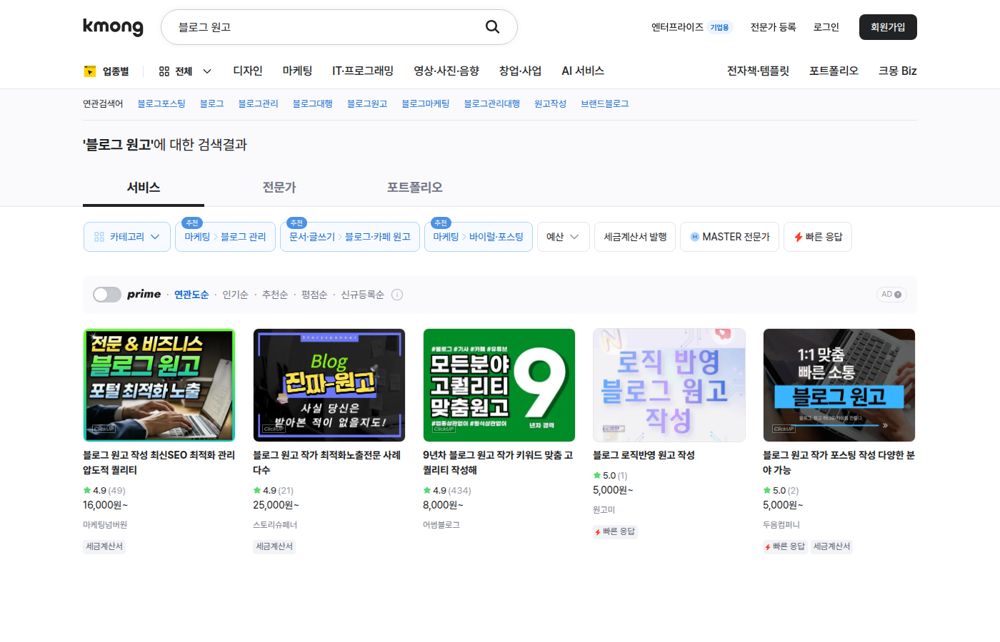

Notion이나 Canva 템플릿은 만들기 정말 쉬워 보인다. 실제로 쉽다. AI에게 구조를 짜 달라고 하고, 제목과 예시 데이터를 넣고, 디자인을 조금 다듬으면 한나절 만에 상품처럼 보이는 게 나온다. 문제는 "상품처럼 보이는 것"과 "팔리는 것"의 거리다.

만들어보면서 깨달은 건, 템플릿은 기능이 아니라 상황을 판다는 점이다. 누가, 언제, 왜 이 파일을 열어야 하는지가 분명하지 않으면 아무리 예뻐도 안 팔린다. "목표 관리 템플릿"은 아무도 안 사지만 "퇴근 후 1시간 부업 기록표"는 살 사람이 떠오른다. "일정 관리 템플릿"보다 "애드센스 블로그 30일 발행표"가, "업무 생산성 템플릿"보다 "전자책 업데이트 로그"가 강하다. 이름에 사용 장면이 들어가는 순간 상품이 된다.

_출처: [Notion Templates](https://www.notion.com/templates) 화면 직접 캡처_

## Notion 마켓에서 본 것: 디자인보다 분류

상단 대표 이미지는 [Notion 공식 템플릿 마켓플레이스](https://www.notion.com/templates) 화면을 직접 캡처한 것이다. 검색창, 카테고리, 템플릿 카드가 보이는데, 눈여겨볼 건 디자인이 아니라 분류였다. 업무용인지, 개인 관리용인지, 공부용인지, 프로젝트용인지. 마켓 자체가 "누구의 어떤 상황"으로 정리되어 있다.

한국어 상품을 만들 때도 같은 질문에서 시작해야 한다. 이 블로그 주제로 좁히면 대상이 꽤 명확하게 나온다. 애드센스 블로그 운영자에게는 30일 발행표와 글감 관리표, 전자책 판매자에게는 업데이트 로그와 보너스 파일 관리표, AI 부업 지원자에게는 플랫폼 지원 기록과 정산 메모, 숏폼 제작자에게는 대본 관리표와 업로드 체크리스트, 프리랜서에게는 제안서 양식.

"AI 부업 관리 템플릿"은 아직도 넓다. "Outlier 지원 기록과 정산 메모를 같이 남기는 표"까지 좁혀야 쓰는 모습이 그려진다.

## 한국어 맥락은 번역이 아니다

해외 템플릿을 한국어로 바꿀 때 제일 흔한 실수가 단어만 번역하는 것이다. Habit tracker를 "습관 추적기"로, finance dashboard를 "재무 대시보드"로. 번역어는 정확한데 아무도 그렇게 검색하지 않는다. 실제 구매자가 원하는 건 "퇴근 후 1시간 부업 기록표", "전자책 판매 정산 메모", "외주 작업 진행표" 같은 자기 상황의 말이다.

입력 예시도 한국어 맥락이 필요하다. 빈 표만 주면 사용자가 직접 생각해야 할 게 너무 많다. 예시 행에 "CapCut 숏폼 대본 5개", "Gumroad 판매 페이지 수정", "크몽 상품 설명 문구 변경"처럼 실제 상황을 넣어두면 사용법이 바로 잡힌다. Canva 템플릿도 마찬가지다. Canva라는 도구 이름보다 카드뉴스, 전자책 표지, 상세페이지 배너, 숏폼 썸네일처럼 구매자가 만들고 싶은 결과물이 먼저다.

## 실제로 팔리는 템플릿 유형

직접 팔아보거나 마켓에서 판매량이 높은 쪽을 분석해보면 공통점이 있다. 반복해서 쓰이는 구조가 있는 것들이 잘 팔린다.

블로그 발행 관리표는 한 번 만들어두면 매달 쓰인다. 글감, 키워드, 발행일, 조회수, 내부 링크 현황을 한 화면에서 관리하면 블로거에게 실제 쓸모가 있다. 프리랜서 정산 메모도 마찬가지다. 의뢰인별 작업 내역, 납기, 입금 여부를 기록하는 단순한 구조가 오히려 오래 쓰인다.

Canva 쪽에서는 소셜 미디어 콘텐츠 일정표가 수요가 있다. 인스타그램 피드 구성, 릴스 업로드 날짜, 썸네일 스타일 등을 관리하는 표는 인플루언서나 소상공인에게 실제로 필요하다.

## AI가 만드는 부분과 사람이 고치는 부분

AI로 템플릿을 만들 때 손이 가는 지점은 의외로 일정하다. 구조(표 열, 섹션, 체크리스트)는 AI가 잘 제안하는데, 실제 사용 순서로 줄이는 건 사람 몫이다. 예시 데이터는 AI가 빠르게 만들지만 한국어 맥락에 맞는 것만 남기는 건 사람이 한다. 설명 문구 초안도 AI가 쓰지만 짧고 구체적으로 다듬는 건 사람이다.

디자인은 화려할 필요가 없다는 것도 배웠다. 오래 쓰는 템플릿일수록 입력하기 쉽고 수정하기 쉬워야 한다. Notion이라면 데이터베이스 이름과 보기 방식이 중요하고, Canva라면 글자 길이가 바뀌어도 레이아웃이 안 깨지는 게 중요하다.

## 판매 가격을 어떻게 잡을까

처음에 너무 낮게 잡는 경우가 많다. "아직 많이 팔리지 않으니까" 하고 무료나 아주 낮은 가격을 매기면 그 낮은 가격이 오히려 품질에 대한 신뢰를 떨어뜨린다.

적당한 시작 가격은 구매자가 "이 정도면 한 번 써볼 만하다"라고 느끼는 선이다. 너무 비싸면 비교하게 되고, 너무 싸면 일회성으로 보인다. 처음에는 미드 레인지 가격으로 시작하고, 리뷰가 쌓이면 올리는 전략이 현실적이다.

번들 구성도 가격 전략이 된다. 단품보다 3~4개를 묶어 팔면 단가가 올라가고, 구매자 입장에서도 하나하나 고르는 수고가 줄어든다. 관련성 있는 템플릿을 묶되, 쓰는 순서가 자연스럽게 이어지도록 구성해야 묶음의 의미가 생긴다.

## 국내 마켓의 말, 그리고 사용법 글

해외 마켓만 보면 한국어 수요를 놓친다. [크몽](https://kmong.com/) 같은 국내 마켓에서 전자책과 AI 서비스 카테고리를 보면 사람들이 어떤 말로 상품을 찾는지 보인다. 전자책 업데이트가 밀리는 사람에게는 업데이트 로그 템플릿이, 블로그 글감이 흩어지는 사람에게는 글감 관리표가, 외주 문의가 산만한 사람에게는 제안서 양식이 답이 된다. 문제에서 출발하면 상품이 나온다.

_출처: [크몽](https://kmong.com/) 검색 화면 직접 캡처_

상세페이지에는 미리보기, 사용 대상, 포함 파일, 수정 가능한 부분, 사용 순서, 업데이트 여부가 들어가야 한다. "예쁜 템플릿입니다"보다 "전자책 업데이트 로그를 10분 안에 정리하도록 만든 Notion 표입니다"가 구매자에게 바로 닿는다.

## 사용법 글이 없으면 절반이 빠진다

템플릿은 파일만 올려두면 쓰임이 안 보인다. 사용법을 블로그 글로 풀어두면 구매자가 자기 상황에 대입하기 쉬워진다. 발행표가 왜 필요한지, 업데이트 로그를 왜 남겨야 하는지 먼저 설명하고, 그다음에 템플릿이 그 과정을 줄여주는 도구라고 보여주는 순서다. 글에서 템플릿을 바로 팔려고 들면 광고처럼 보인다.

사용법 글은 SEO 유입도 만든다. "Notion 부업 관리 방법"을 검색하는 사람이 글에 들어왔다가 관련 템플릿을 구매하는 흐름이 생긴다. 글과 상품이 서로를 뒷받침하는 구조가 되면 홍보 따로 상품 따로 운영하는 것보다 훨씬 효율적이다.

정리하면, Notion·Canva 템플릿 판매는 AI로 많이 찍어내는 일이 아니었다. 적게 만들더라도 쓰는 장면이 선명해야 한다. 한국어 사용자의 맥락을 보고, 마켓에서 실제로 쓰이는 말을 살피고, AI 초안을 사람 손으로 줄이고, 사용법은 글로 따로 풀어둔다.

참고한 공개 화면: [Notion Templates](https://www.notion.com/templates), [Canva](https://www.canva.com/), [크몽](https://kmong.com/)
