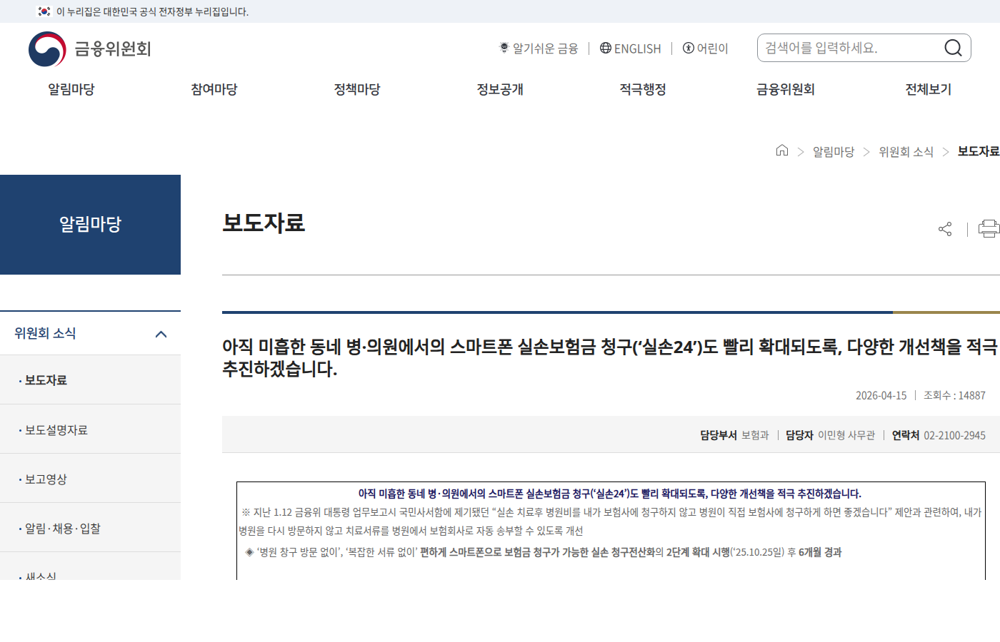

이 글은 의료 조언이 아니라 제도와 청구 절차 안내다. 개인별 보장 여부는 본인 약관과 가입 보험사 확인이 필요하다. 내용은 2026년 6월 14일 기준 금융위원회 자료를 바탕으로 정리했다.

병원비를 내고 실손보험 청구를 미루다가 그냥 넘어간 경험이 다들 한 번은 있다. 서류 떼러 병원에 다시 가는 게 귀찮아서다. 실손24는 그 서류 단계를 전산으로 바꾸는 서비스다. 다만 모든 병원, 모든 청구에 되는 게 아니라서, 되는 경우와 안 되는 경우를 나눠 적는다.

## 실손24가 하는 일

실손24는 실손보험 청구 전산화 서비스다. 병원이나 약국이 실손24에 연계되어 있으면, 청구에 필요한 진료비 관련 서류가 종이를 거치지 않고 전산으로 보험사에 넘어간다. 금융위원회는 청구 전산화와 실손24 확대를 계속 추진하고 있고, 2026년 4월에도 요양기관 연계 현황과 참여 확대 방안을 점검했다.

_출처: [금융위원회 실손보험 청구 전산화 추진 현황](https://www.fsc.go.kr/no010101/86709) 화면 직접 캡처_

핵심은 "연계"라는 단어다. 전산 청구가 되느냐는 내 보험이 아니라 내가 간 병원이 연계 기관이냐에 달려 있다.

## 실손보험 세대별로 보장 구조가 다르다

실손보험을 가입한 시기에 따라 상품 구조가 다르다. 흔히 1세대부터 4세대까지로 나뉘는데, 가입 시기에 따라 보장 범위, 자기부담금 비율, 비급여 처리 방식이 모두 다르다.

2009년 이전 가입자는 자기부담금이 없거나 낮은 편이고, 이후 가입자는 단계적으로 자기부담 비율이 높아졌다. 2021년 이후 가입한 4세대 실손의 경우 비급여 부분에서 자기부담금이 크게 올라갔다. 내 보험이 몇 세대인지 모른다면 가입 증서나 보험사 앱에서 먼저 확인해야 한다.

청구 절차는 비슷하더라도, 실제로 돌려받는 금액은 세대마다 크게 다를 수 있다.

## 서류 없이 되는 경우

- 진료받은 병원·약국이 실손24에 연계되어 있다
- 실손24 앱이나 웹에서 해당 진료 내역이 조회된다

이 두 가지가 맞으면 앱에서 진료 내역을 선택해 청구까지 끝난다. 종이 서류를 떼고 사진 찍어 올리던 절차가 통째로 사라진다.

연계 기관은 실손24 웹사이트에서 기관 검색으로 확인할 수 있다. 대형 병원 중심으로 먼저 연계가 진행됐고, 동네 의원이나 약국까지 확대되는 중이다. 자주 가는 병원이 연계됐는지 미리 확인해두면 다음 번 청구 때 편하다.

## 안 되는 경우와 그때 할 일

- 병원이 아직 실손24에 연계되지 않은 경우
- 전산으로 전송되지 않는 서류가 추가로 필요한 경우

연계 여부는 실손24에서 기관 검색으로 확인된다. 안 되는 병원이라면 기존 방식대로 서류를 준비해야 한다. 이때 기본은 진료비 영수증과 진료비 세부내역서다. 영수증은 총액만 나오고, 세부내역서가 있어야 항목별로 비급여가 뭐였는지 보인다.

청구 누락이나 반려를 줄이려면 병원 수납 창구에서 두 가지를 같이 떼는 게 좋다. 통원이냐 입원이냐, 금액이 얼마냐에 따라 보험사가 요구하는 서류가 달라진다. 떼러 가기 전에 보험사 앱이나 콜센터에서 필요한 서류 목록을 먼저 확인하면 두 번 걸음을 덜 수 있다.

## 소멸시효를 확인하는 게 중요하다

병원비를 오래 묵혀뒀다면 소멸시효를 확인해야 한다. 실손보험 청구권의 소멸시효는 약관에 따라 다르지만, 일반적으로 3년으로 많이 설정되어 있다. 3년이 지나면 청구 자체가 불가능해진다.

과거에 병원을 다녔는데 영수증이 남아있다면, 포기하기 전에 약관을 먼저 확인하자. 오래된 병원비도 소멸시효 안이라면 청구된다. 진료비 영수증을 버렸더라도 병원에 요청하면 일정 기간 내의 서류는 재발급해준다. 병원마다 보존 기간이 다르니 먼저 전화로 확인하는 게 좋다.

## 약국 영수증도 청구 대상이다

실손보험은 병원 진료비만 된다고 생각하는 사람이 많은데, 처방전에 따른 약국 약제비도 청구되는 경우가 있다. 보통 원외처방전을 받아 약국에서 조제한 약이 청구 대상이다.

약국 영수증과 처방전 사본(또는 처방전 정보)을 함께 보관해두면 나중에 청구할 때 편하다. 약국에서 조제비 영수증을 받을 때, 처방전을 그냥 돌려받아서 같이 보관해두는 습관을 들이면 청구를 놓치는 일이 줄어든다.

## 청구 전 확인 체크리스트

- 내 진료 병원이 실손24 연계 기관인가
- 청구하려는 진료가 내 실손 가입 세대(가입 시기별 상품) 기준으로 보장 대상인가
- 진료비 영수증과 세부내역서 중 뭐가 필요한가
- 청구 소멸시효가 지나지 않았는가 (오래 묵힌 병원비도 약관상 기간 안이면 청구 가능하다)
- 본인 명의 계좌 정보가 준비됐는가
- 처방전 약제비도 함께 청구할 수 있는가

보장 여부 판단은 이 글이 해줄 수 없는 부분이다. 같은 진료라도 가입 시기와 상품에 따라 보장이 다르다. 약관 확인과 보험사 문의가 기준이다.

## 도수치료 청구는 따로 확인이 필요하다

최근 도수치료의 관리급여 전환과 수가·횟수 제한이 크게 보도되고 있다. 도수치료를 받는 중이거나 받을 예정이라면, 청구 전에 병원에 이렇게 물어두자. 이 치료가 급여인지 비급여인지, 횟수 제한에 걸리는지, 내 실손 상품 기준으로 본인부담이 얼마인지. 제도 변경 시점 전후로 기준이 갈릴 수 있는 주제라, 변경 내용이 확정되는 대로 별도 글로 정리하겠다.

## 보험사 앱을 먼저 확인하는 게 빠를 수 있다

많은 보험사가 모바일 앱에서 실손보험 청구를 바로 처리하도록 해뒀다. 병원이 실손24에 연계되지 않았더라도, 보험사 앱에 진료비 영수증과 세부내역서 사진을 올려 청구하는 경우가 많다.

가입 보험사가 어디인지 확인하고, 그 앱에서 청구 메뉴를 먼저 살펴보자. 아예 실손24와 연동된 앱도 있고, 독자적인 청구 화면을 운영하는 곳도 있다. 보험사마다 요구 서류와 절차가 조금씩 다르니, 처음 청구하는 보험이라면 앱 안내나 콜센터에 먼저 확인하는 게 안전하다.

병원비와 보험 글은 이 블로그에서 계속 다룬다. 원칙은 하나다. 치료 판단은 의사와, 보장 판단은 약관과 보험사와, 이 블로그는 절차와 확인 질문을 정리한다.

## 공식 확인처

- 금융위원회, 실손보험 청구 전산화 추진 현황: https://www.fsc.go.kr/no010101/86709
- 실손24: https://www.silson24.or.kr/

제도 내용은 발행일 기준이며, 연계 기관과 절차는 계속 확대·변경되고 있다.
