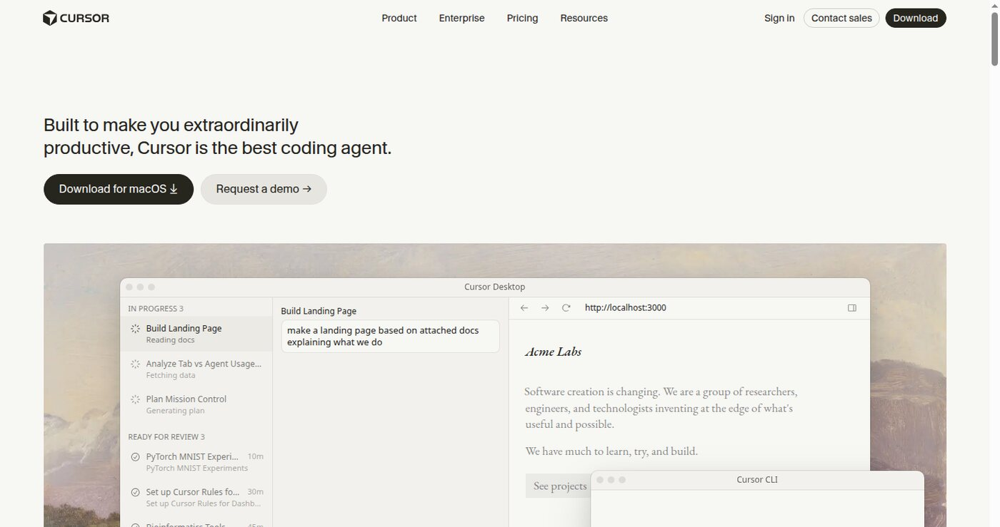
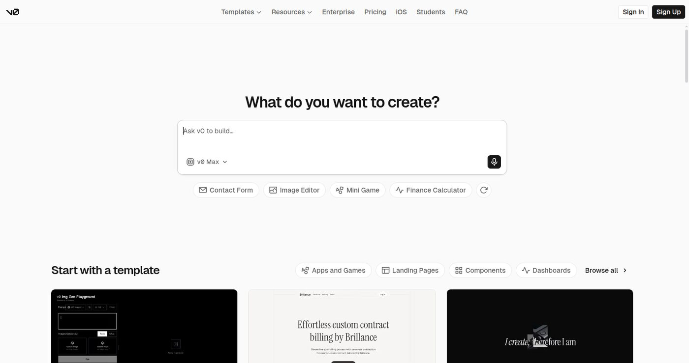
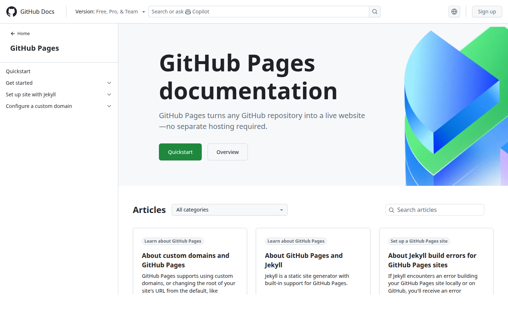

바이브 코딩으로 부업을 하겠다고 마음먹으면 제일 먼저 드는 생각은 "앱 하나 만들어볼까"다. v0에 말하면 화면이 나오고, Cursor로 고치면 코드가 움직이니까, 앱 전체도 금방 될 것 같은 기분이 든다. 그런데 외주로 팔 생각이라면 이 기분을 한 번 의심해야 한다. 팔리는 건 "멋진 앱"이 아니라 끝까지 책임질 수 있는 범위다.

그래서 나는 1페이지 랜딩페이지부터 시작했다. 계산기, 문의 폼, README 정리도 같은 급이다. 결과가 분명하고, 설명하기 쉽고, 포트폴리오로 남는다. 반대로 로그인, 결제, 개인정보 저장, 관리자 기능, 데이터베이스는 책임이 큰 영역이라 경험이 쌓인 뒤로 미뤘다.

_출처: [Cursor](https://cursor.com/) 화면 직접 캡처_

## Cursor: 고치는 데 편했다

상단 대표 이미지는 [Cursor](https://cursor.com/) 공개 홈 화면을 직접 캡처한 것이다. AI 코딩 에이전트가 랜딩페이지를 만드는 예시가 나온다. 실제로 써보면 문장으로 요청하는 대로 코드가 바뀌고 화면이 따라 바뀐다. 처음엔 마법 같다.

그런데 도구가 코드를 빨리 만들어주는 것과 의뢰인에게 넘겨도 되는 상태는 다르다. 문구가 맞는지, 모바일에서 깨지지 않는지, 버튼이 실제 링크로 이어지는지, 이미지가 무겁지 않은지, 배포 경로가 맞는지. 이 마무리는 전부 사람 몫이고, 사실 외주의 품질은 여기서 갈린다.

## v0: 첫 화면 초안용으로 잘 맞았다

[v0](https://v0.dev/)도 같이 써봤다. 공개 홈에 프롬프트 입력창과 랜딩페이지·대시보드 템플릿이 있는데, 써본 느낌으로는 완성품을 한 번에 뽑는 도구라기보다 첫 화면 초안을 빨리 만드는 도구다. 그래서 역할을 나눴다. v0는 랜딩페이지·카드 UI·입력 폼 초안, Cursor는 코드 수정·문구 교체·구조 정리, GitHub는 저장소와 README와 배포 기록, GitHub Pages는 정적 페이지 배포. 각 단계마다 사람이 검수한다.

프롬프트는 짧게 쪼개는 게 요령이다. "멋진 랜딩페이지 만들어줘"라고 하면 결과도 두루뭉술하게 나온다. "전자책 판매용 첫 화면을 만들고 제목은 AI 부업 30일 운영표로 해줘", "가격 섹션은 카드 2개로 나눠줘", "모바일에서 버튼이 아래로 줄바꿈되게 해줘"처럼 단계별로 요청하면 결과가 잡힌다.

_출처: [v0](https://v0.dev/) 화면 직접 캡처_

## 처음 제안하기 좋은 작업 다섯 가지

여러 번 시도해보고 다섯 가지로 좁혔다. 기준은 "끝난 상태"를 정의할 수 있느냐다.

| 작업 | 어울리는 의뢰 | 끝난 것으로 볼 기준 |
| --- | --- | --- |
| 1페이지 랜딩페이지 | 전자책, 온라인 클래스, 작은 서비스 소개 | 섹션 5개, 모바일 대응, CTA 링크 |
| 계산기나 견적 폼 | 가격 추정, 점수 계산, 간단한 진단 | 입력값, 결과값, 오류 문구 |
| 문의 폼과 FAQ 섹션 | 상담 유도 페이지 | 폼 화면, FAQ 5개, 연결 링크 |
| 기존 페이지 문구·레이아웃 수정 | 이미 사이트가 있는 의뢰인 | 수정 전후 비교 |
| GitHub README와 배포 안내 | 포트폴리오 정리 | README, 배포 링크, 사용 도구 |

오해하면 안 되는 게, 작게 시작하라는 말이 싸게 받으라는 뜻은 아니다. 범위를 명확히 하라는 뜻이다. "랜딩페이지 만들어드립니다"가 아니라 "전자책 판매용 1페이지 랜딩페이지, 섹션 5개, 모바일 대응, 배포 링크 포함"이라고 적는다. 범위가 선명하면 가격도 설명이 된다.

## 상담 전에 순서와 자료를 정해둔다

작업 순서는 미리 잡아뒀다. 의뢰인의 목적 확인 → 반드시 들어갈 문구와 이미지 받기 → 화면 구조 나누기 → v0로 초안 → Cursor에서 문구·링크·반응형 수정 → GitHub와 배포 링크 정리 → 모바일·버튼·이미지 최종 확인. 순서가 있으면 상담 중에 "어디까지 해주실 수 있어요?"라는 질문에 흔들리지 않는다.

자료도 먼저 받는다. 상품명과 한 줄 소개, 주요 섹션, 가격과 혜택, 이미지와 로고, 참고 사이트, 연결할 링크, 문의 방법. 자료가 있으면 AI가 마음대로 채우는 문구가 줄고, 작은 랜딩페이지는 정리 속도가 확 빨라진다.

선 긋기도 미리 해둔다. 결제 정보를 직접 처리하는 기능, 개인정보를 저장하는 기능, 법률·의료처럼 검수가 필요한 영역, 보안 책임이 큰 기능은 아직 안 받는다. 초반에는 외부 결제 링크나 구글폼·타입폼 같은 기존 도구를 연결하는 선에서 시작해도 충분하다.

## 샘플 3개면 상담이 달라진다

포트폴리오는 3개로 시작했다. 전자책 판매 랜딩페이지(섹션 구성·CTA·모바일 화면), 간단한 가격 계산기(입력값·결과값·에러 처리), 개인 서비스 소개 페이지(프로필·작업 범위·문의 버튼). 각 샘플에는 어떤 문제를 풀었고, 뭘 만들었고, 어떤 도구를 썼는지와 함께 배포 링크와 GitHub 링크를 적었다.

README도 빼놓지 않았다. 의뢰인은 코드를 읽지 않는다. 대신 공개 링크가 있고, 과정이 적혀 있다는 사실에서 신뢰를 느낀다. "AI로 만들었습니다" 한 줄보다 "v0로 초안을 만들고 Cursor로 반응형을 수정한 뒤 GitHub Pages로 배포했다"가 훨씬 강하다.

_출처: [GitHub Pages 문서](https://docs.github.com/pages) 화면 직접 캡처_

바이브 코딩 부업은 작은 화면, 작은 기능, 작은 수정에서 시작할 때 설명이 쉽다. AI가 초안을 빨리 만들고, 사람이 넘겨도 되는 상태로 다듬는다. 이 구조는 외주 상품으로도, 블로그 글감으로도 그대로 쓰인다. v0로 샘플 만들기, Cursor로 문구 고치기, GitHub Pages로 배포하기, 외주 범위 정하는 법. 전부 이 글처럼 글이 된다.

참고한 공개 화면: [Cursor](https://cursor.com/), [v0](https://v0.dev/), [GitHub](https://github.com/), [GitHub Pages 문서](https://docs.github.com/pages)
