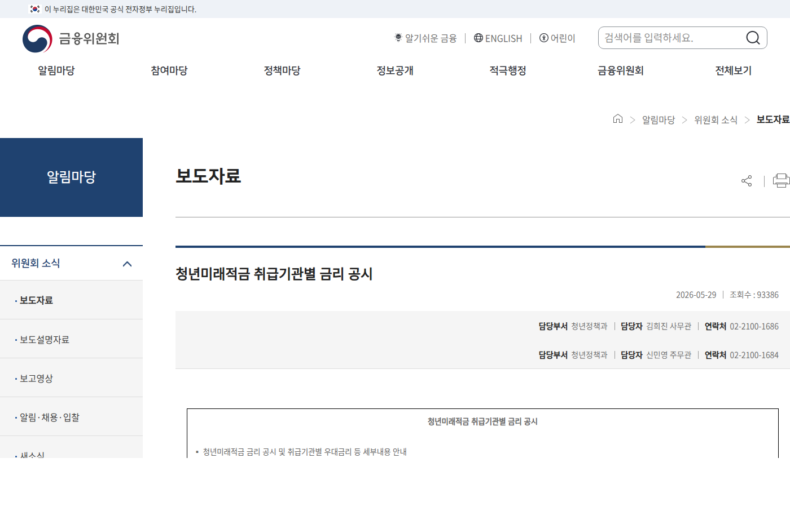

이 글은 2026년 6월 13일 기준 금융위원회 공시 조건으로 계산했다. 아래 숫자는 공시된 기본 구조에 단리 가정을 더한 추정치다. 실제 만기금액은 가입 기관의 약관과 정부기여금 지급 기준에 따라 달라지니, 가입 전에 은행 화면에서 확인하는 게 정확하다.

청년미래적금 글마다 "최대 12% 매칭", "기본금리 5%"라는 말은 나오는데, 정작 3년 뒤 통장에 얼마가 찍히는지 계산해주는 글은 드물다. 그래서 직접 계산했다.

_출처: [금융위원회 청년미래적금 취급기관별 금리 공시](https://www.fsc.go.kr/no010101/87005) 화면 직접 캡처_

## 계산에 쓴 조건

| 항목 | 값 | 근거 |
| --- | --- | --- |
| 월 납입 | 50만 원 | 월 최대 한도 |
| 기간 | 36개월 | 3년 만기 |
| 기본금리 | 연 5% | 금융위원회 공시 |
| 우대금리 | 연 2~3% | 기관별 상이 |
| 세금 | 비과세 | 이자소득 비과세 |
| 정부기여금 | 최대 12% 매칭 | 공시 구조 |

이자는 적금 방식(매달 넣은 돈이 남은 기간만큼만 이자를 받는 단리 구조)으로 계산했다.

_출처: [정책브리핑 청년미래적금 가입신청 일정 안내](https://www.korea.kr/multi/visualNewsView.do?newsId=148966185) 화면 직접 캡처_

## 원금: 1,800만 원

월 50만 원씩 36개월이면 원금은 1,800만 원이다. 여기까지는 누구나 같다. 차이는 이자와 기여금에서 갈린다.

## 이자: 금리 가정별로 약 139만~222만 원

적금 이자는 첫 달 납입금이 36개월치, 마지막 달 납입금이 1개월치 이자를 받는 구조다. 이 방식으로 계산하면 다음과 같다.

| 적용 금리 | 이자(비과세) |
| --- | ---: |
| 기본 5%만 | 약 139만 원 |
| 5% + 우대 2% = 7% | 약 194만 원 |
| 5% + 우대 3% = 8% | 약 222만 원 |

일반 과세 적금이라면 이자에서 15.4%를 떼지만, 이 상품은 비과세라 이 금액이 그대로 남는다. 우대금리 2~3% 차이가 3년 누적으로 55만~83만 원 차이를 만든다. 은행 고를 때 우대 조건을 따져야 하는 이유가 숫자로 보인다.

## 정부기여금: 최대 기준으로 약 216만 원

공시된 구조는 납입액 대비 최대 12% 매칭이다. 1,800만 원을 다 채우고 최대 매칭을 받는다고 가정하면 216만 원이다. 다만 "최대"라는 단서가 붙은 만큼 소득 구간이나 유형에 따라 매칭률이 달라질 수 있다. 본인 매칭률은 가입 신청 화면에서 확인되는 값을 기준으로 봐야 한다.

## 합계

| 시나리오 | 원금 | 이자 | 기여금(최대 가정) | 합계 |
| --- | ---: | ---: | ---: | ---: |
| 기본금리만 | 1,800만 | 약 139만 | 약 216만 | 약 2,155만 |
| 우대 2% 충족 | 1,800만 | 약 194만 | 약 216만 | 약 2,210만 |
| 우대 3% 충족 | 1,800만 | 약 222만 | 약 216만 | 약 2,238만 |

1,800만 원을 부어서 최대 430만 원 안팎이 얹히는 구조다. 3년 묶이는 대가로는 상당한 조건이다.

## 월 납입액을 낮추면 어떻게 되나

자유적립식이라 월 50만 원이 의무가 아니다. 월 30만 원으로 넣으면 원금이 1,080만 원이 되고, 같은 비율로 이자와 기여금이 붙는다.

| 월 납입 | 원금 | 이자(우대 3% 기준) | 기여금(최대) | 합계 |
| --- | ---: | ---: | ---: | ---: |
| 30만 원 | 1,080만 | 약 133만 | 약 130만 | 약 1,343만 |
| 40만 원 | 1,440만 | 약 178만 | 약 173만 | 약 1,791만 |
| 50만 원 | 1,800만 | 약 222만 | 약 216만 | 약 2,238만 |

50만 원을 무리해서 채우다 중도해지하는 것보다, 30만 원으로 36개월을 완주하는 쪽이 실제로 돌아오는 금액이 크다. 중도해지하면 정부기여금 전액을 반환하고, 이자소득 비과세 혜택도 사라진다.

## 이 계산이 성립하지 않는 경우

위 표는 전부 "만기까지 간다"는 전제 위에 있다. 중간에 깨면 비과세도 기여금도 온전히 못 챙긴다. 그래서 계산보다 중요한 질문은 이거다. 월 50만 원을 36개월 동안 안 건드릴 수 있는가.

자신이 없다면 금액을 낮추면 된다. 자유적립식이라 월 30만 원이면 원금 1,080만 원에 같은 비율로 이자와 기여금이 붙는다. 50만 원을 채우려고 비상금 없이 시작하는 것보다, 30만 원으로 만기까지 가는 쪽이 결과가 좋다.

## 비상금과 병행하는 게 맞다

청년미래적금에 납입하는 금액 외에 별도 비상금을 유지하는 게 중요하다. 적금을 중도에 깨는 가장 흔한 이유는 갑작스러운 지출이다. 이사, 의료비, 실직 같은 상황이 생기면 적금을 깨야 한다는 압박을 받게 된다.

비상금을 얼마나 잡을지는 개인 상황마다 다르지만, 3~6개월치 생활비를 별도 계좌에 두고 청년미래적금을 시작하면 안정적이다. 그래야 예상치 못한 지출이 생겨도 적금을 건드리지 않는다.

가입 조건과 5부제 일정은 [신청 전 확인 글](/posts/youth-future-savings-checklist/)에 정리했다. 신청기간은 6월 22일부터 7월 3일까지다.

## 공식 확인처

- 금융위원회 청년미래적금 취급기관별 금리 공시: https://www.fsc.go.kr/no010101/87005
- 정책브리핑 가입신청 일정: https://www.korea.kr/multi/visualNewsView.do?newsId=148966185

숫자는 발행일 기준 공시 조건에 따른 추정이고, 실제 지급액은 가입 기관 기준이 우선한다.
